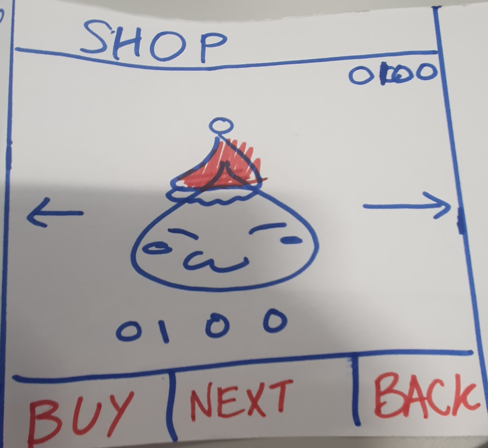
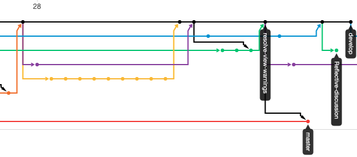
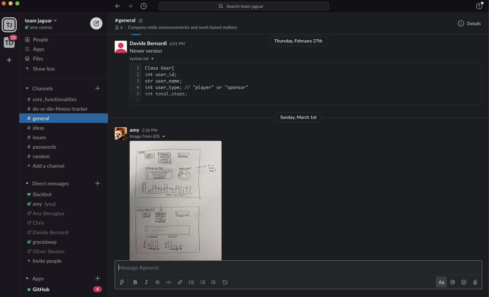
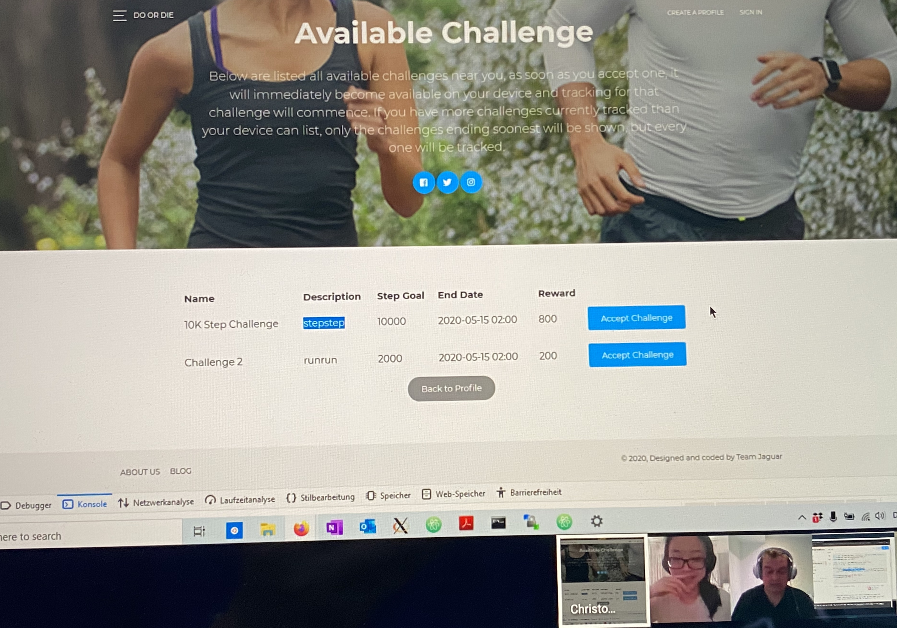

# Project Evaluation:

In the following section, we will evaluate both the [design](Portfolio/SystemDesign.md) and [implementation](Portfolio/SystemImplementation.md) of our product. We will critically analyse the success of our project, including issues that still remain in the implementation of our product. We will also discuss areas for future work and evaluate how our group worked, especially in light of the move to remote working. 

## Table of Contents
- [**Reflective discussion on the success of the project**](#reflective-discussion-on-the-success-of-the-project)
  - [General reflection of success](#general-reflection-of-success)
- [**Discussion of future work**](#discussion-of-future-work)
  - [Currency, shop and customization](#currency-shop-and-customization)
  - [Connect M5Stack to a user account](#connect-m5stack-to-a-user-account)
  - [Module specific improvements](#module-specific-improvements)
    - [M5Stack](#m5stack)
    - [Web](#web)
    - [Desktop](#desktop)
  - [Summary](#summary)
- [**Discussion of group working practices**](#group-working-practices)
  - [Agile communication](#agile-communication)
  - [Github process](#github-proccess)
  - [Communication tools](#communication-tools)
  - [Management of issues](#management-of-issues)
  - [Overall reflection](#overall-reflection-on-group-working-practices)
- [**Reflection on the effect of COVID-19 on the project**](#reflection-on-the-effect-of-covid-19-on-the-project)
- [**Conclusion**](#conclusion)

## Reflective discussion on the success of the project

### General reflection of success

Overall we are proud what we have achieved as a group since [beginning this project](https://github.com/Team-Jag/Do-or-die-fitness-tracker/blob/develop/Portfolio/SystemDesign.md#ideation-and-concept-development). We have delivered a working prototype of an idea we crafted in the early phase of this unit. In the following section we will reflect on the the success of our project. 

It was difficult as a group to come to a definition of what success meant in regards to our product. If you had asked us when we first began our ideation process, we may have had an exagerated idea of the product that we were excited to build, along with an overly complicated architecture that we had drawn up - thinking the more complicated, the better. However, if you asked us after we undertook our first user evaluation, we likely would have defined success as creating a product that a user can see no flaws with. It is possible that after learning more about the design process and all the possible diagrams out there, we would have defined success as even being able to create every diagram that we had been introduced to. Perhaps after learning more about version control and Github, we would have told you that success is being able to create a pull request and see that there are no merge conflicts. It is clear then, that there is no one definition of success, but rather a number of small instances that lead to our team feeling that our project was successful. We will consider these in this section, before moving on to consider how we could further our project in the future work section, and finally evaluating how we worked as a group. 

When we began defining the architecture of our Do or Die Fitness Tracker, and outlining the Minimum Viable Product (MVP), we knew that the first step that we wanted to achieve was each of our key subsystems communicating with each other. When this happened, and we knew that the live step count was being updated in the Processing application, this was the first time that our team felt truly successful. We knew that we would be able to work together, and between each subsystem, to create a product that effectively and accurately used all three key subsystems. 

Upon reflecting on our final system architecture, we feel that we have implemented a system that is maintainable, secure, and able to scale. As this is a prototype that must be able to scale for a larger userbase, we feel confident in the design choices that we made and that we were not only considering the current issues at hand but also the future of our product. We have also created a system archiecture that is adaptable, and able to respond to new requirements. This was incredibly important when following an Agile development cycle, as we had to ensure that we did not design our architecture once at the beginning and never change it. 

Indeed, our team was able to successfully follow the Agile development cycle. We put the user before our initial system design, and small parts of our architecture and system changed during each sprint in response to changing user requirements. A large part of our success comes from how well our group worked, which will be explored in further detail below. However, by following the Agile development cycle we were able to adapt to the COVID-19 pandemic and adapt our requirements with the changed assignment brief with little issue. Moreover, we tested our system well as one unit during each sprint which ensured our success. We integrated it at the end of each sprint, rather than leaving it to the end of our project, which ensured that we always had a working product. 

Finally, which is perhaps is the greatest measure of our success, is how well our team worked together and how much we learnt. Our working practices will be explored further, but each of our team is now confident in many aspects of software engineering as well as the ability to work well in a group. We will now consider the success of each of our key subsystems. 

#### M5 ####
In order to ensure the success of perhaps the most important subsytem, the M5Stack team had to prioritise the end-user stories that we implemented in each sprint. In order to do this, we ensured that we first had a pedometer before moving on to adding animation and then further features including challenges and statistics. By implementing each feature indiviiually, and during each sprint, rather than all at once, the M5 team was able to quickly adapt to changes in requirements. 

#### Web ####

In the web sub-team our approach was "very agile" in the sense that we had very short cycles with little consideration for the implications of design choices on other planned features. The advantage was that we had a first working version of the website within a day and the first integration with the other systems after a week. However, with every new cycle the need to refactor code increased, as the limitations of the intial design choices became clear. This method worked great beacuse it allowed us to deliver a woking prototype in weeks, at the same time it showed us that systems intended for long term use need flexibility in their design and fundamental design choices must take into account the requirements of the system as a whole.

#### Desktop ####
The desktop team also followed agile processes in line with user story implementation defined within sprints each week. Due to the seperate nature of back and front ends of this subsystem (each of which can be considered subsystems in its own right) this meant a mostly large modularity in implementation as each section could be developed seperately. However as mentioned earlier, the primary dependancy between modules was request type which caused bugs when request spellings had minor differences ("pull sponsor" vs "pull sponsors"). This caused significant challenge in hunting down these specific bugs for the desktop team, but additionally caused issues during integration tests for the other teams as all communication must pass through the desktop app to access persistant data. 

In the next section we will discuss future areas of work; including items that were pushed to the backlog. 

#### Overall Design ####

In our first sprint we did a good job at defining the MVP, agreeing on the over design and the interactions between the subsystems. This set us to work independently and made the success of of project resistant to the initial Corona disruption: it did not matter where each of us was, we all knew exactly what we had to do. As a result our alpha version was complete relatively fast and satisfied most of the MVP requirements. We then agreed as a group which additional features we would implement for the beta version. Unfortunately in this second iteration we did not follow the same rigor when designing the the system, we all were confident that we know "our systems" and adding some new features would be "easy". We paid the price for that complacency a couple of weeks later, before the release of our beta version: during the final end-to-end test some of the subsystems would crash and each of us had to spend a couple of hours to identify the bugs in their systems. Amazingly they all turned out the be easy to fix: they all originated from misunderstanding between our sub-groups (e.g. different spelling in the request types or different understanding of the  exact purpose of the request). This remined us of how important a system design with clear requirements and test cases is when working in a group. Had we invested an hour more into the design in that second iteration, it would have saved us countless hours of finding and fixing bugs.

 
## Discussion of future work 
In general, due to our time constrains, in our project we rushed through big chunks of what would be a normal design process, completely skipping the Discover and Define parts for example. So, the first step for any kind of future work would be to first do extensive market research to better understand where the Do or Die Fitness Tracker fits in the Product Space, what our Target market is, and whether there are existing companies that could be classified as our competitors.

Below we will consider some additional features that would make our product more viable, how we came up with the feature, and how it would fit in our current design. We will also consider how we would develop it, implement it, and what methods we would use to evaluate it.

### Currency, Shop and Customization
The first improvement consists of multiple features which would need to be added more or less concurrently, since it does not make sense to have one without the other. It's worth noting that we first thought of this feature when designing our first UI wireframe, it came up when discussing possible avenues of monetization for our product. However, this has been pushed to our backlog for future sprints.

<p align="center">

</p>

This feature would include the addition of a Shop for our users.We would add some type of virtual coin to our product, Sponsors would be able to set coin rewards for their challenges, users would be able to obtain a small amount of currency each day by completing the challenges, or they could purchase it using real currency through our website.

Currency can then be used to unlock accessories for the Bean in the new "Shop" screen directly on the M5Stack. Accessories will simply be graphical enhancements for the Bean at first, things such as hats or scarves, however an important property of this improvement is how flexible it is: once a shop is created we can decide whether to make any feature accessible to the user by default, or unlockable with currency using the shop (i.e. if we added a leveling system to our Bean, we could have "experience boosts" in the shop to increase their level faster). The final piece necessary for this improvement is to add the possibility to customize the Bean sprite. 

Implementing this change would require large changes for each of our subsystems.In the desktop, we would need to store some new data for each user: their Bean's custom features, their unlocked accessories, and their currency. In our shared contract we'd have to add these new data-types to our requests. At the moment the Bean's appearance and animation is hardcoded in the M5Stack, we would have to make this dynamic and store the bean's appereance data in the Desktop Server. We'd also have to add a new "ShopView" class similar to our other View classes. In the  web app we'd need to implement a new "Shop" page, but most importantly we would have to develop a secure payment system using something like PayPal.

Ideally we would implement this before we start taking on large number of users, since when a free to use product adds a monetization feature user tend to react negatively. However this means we wouldn't be able to get user feedback to help us evaluate this new feature, which means we'd probably have to base our evaluation on a simple SWOT analysis.

### Connect M5Stack to a User Account
For our prototype, the user_name of the M5Stack's owner is hardcoded in the Arduino code, an enhancement necessary for public release would be to create a mechanism to link an M5Stack to a user. We believe the best way to do this is to hardcode an M5Stack_id inside the M5Stack, and when a new DoOrDie device is purchased and first turned on, the screen will simply show the hardcoded ID along with a quick guide on how to create an account on the Web and connect the device to the user by assigning the ID to the web account.

Implementation would require adding this M5Stack_ID field to our data schema and shared contract, and then including this first starting screen on the M5Stack using a new "StartView" class. On the web we would have to add a simple new "Change Stack ID" option.

Since this feature would need to come online before release, we couldn't evaluate it with user feedback. However a good metric for this type of "login features" is how many clicks/actions it takes the user to go from start-up to a system ready for use, so that would probably be what we would use to optimise this feature. 

### Module specific improvements 
The features discussed above are things that, to be implemented, would need non-trivial work done on each of our subsystems. We will now consider individual changes and improvements for each module.

#### M5Stack
The M5Stack revolves around two main tasks: tracking the user's fitness level through their step count and motivating the user to increase their fitness level through an animated sprite.

While we believe that our proof of concept accurately depicts the M5Stack's capabilities as a Pedometer, we do acknowledge that there is room for improvement in terms of accuracy and further usage. In order to improve the M5Stack's fitness tracking capabilities, we would work on refining our Pedometer to let it detect whether the user is running, walking up the stairs, and even swimming or cycling. We could consider adding an external module to monitor useful biometrics such as hearth rate.

These would have to be stored in the Desktop Database, however it would be relatively easy to add those fields to a user's profile, aside from that all of the development would happen exclusively within the M5Stack. We have not been able to look much into this due to time constraints, however we suspect we would be able to find libraries or sample code online that would make it easy for us to add the above mentioned new metrics to our fitness tracking. Due to the fact that our Pedometer code was sourced through an open source project, we are confident that this improvement is possible. Moreover, the M5Stack has a number of additional features and capabilities that we have not yet tapped in to, and thus we are confident in the M5Stack's ability to preform well with these enhancements. 

The success of our product heavily relies on how much the user is emotionally attached to their bean, therefore making the animations more realistic and life-like would be one of the most important improvement we could undertake to make our product more viable.
We could add more complex behaviour for the bean, ideally relating it to the user's ativity. For example, if the user is just sitting down or not walking, the Bean would look more bored through its facial expressions, possibly by shutting its eyes or 'going to sleep'. However, if if the user is walking or even running the bean would look excited, by demonstrating a smile. When the user completes a campaign, the bean would do some type of "Well done buddy!" animation. Our imagination is the only limit for this one in terms of features we could add, with the goal of making the bean feel more and more like a real pet that the user can take care of. We believe that the implementation of this feature would improve customer retention. 

There would be technical difficulties to implement this however. As we experienced while developing our prototype, the M5Stack's graphics library is somewhat slow and basic, as drawing basic shapes makes it slow enough that we can notice a flicker. So adding complex 3d-like animations sounds like an impossible task. However while writing our animations for the prototype, we came across the "TFT Arduino Library" which is supposed to be a faster graphics library for arduino products, so we would prioritise integrating that library into our existing code.

Both of these are little more than quality of life improvements, so we could add these incrementally even after release, which would allow us to gather user feedback to make the evaluation of each change straightforward. We would likely implement a bi-weekly or monthly patch system where we push the next set of improvements and gather user feedback before the next set. Down the road we might even have a public beta version of our product up at all times, so that our "bravest" users can preview and test our planned changes while at the same time helping us by reporting any bugs they find.

#### Web
Our website is used to connect our sponsors to our users, and to allow the user to utilize any of the features which are too complex to sit inside the M5Stack. However the fact that a user needs to go on a website to access all our feature is not ideal given our target customer. The hope of this product is that anyone using it would not be sitting at home on their computer, so they would have to access our website on their phone. But a much better option would be to have the user access our product's feature through a bespoke Mobile App!

Having an app for our product would reinforce our connection with the User by allowing us to send them notification related to their Bean's health level and even to their performance in Challenges they're enrolled in. We would also keep our Website in particular for Sponsors to track challenges, but also for user who does not feel like using our app or wishes to view their data in a larger format than their phone. 

Developing an app would be quite a long process, however thanks to our separation on concerns we would be able to do this without affecting the M5Stack or the Desktop. In order to design our app, we would look at similar fitness tracking products and see which features are the most beneficial. For the user, this may include more graphs and charts on their performance. This is likely to increase customer retention as we are eliminating the need for them to log on to our website to view basic statistics, and also encouraging them using push notifications. 

Apps for products such as ours can be a risky, so we would do extensive evaluation work to ensure we deliver a good and polished product. Prior to the development of an app, we would perform user group testing to see what features we should focus on implementing. We would likely design a closed beta version, and we'd give out codes to some of our most active users to get their feedback while at the same time generating widespread interest for it. We are confident that the addition of an app would only improve our product, and allow for the users to get more involved with Challenges and other features. 

#### Desktop
Our desktop app is effectively our back-end, with also a little bit of front-end data visualization which allows the Admins to gauge how well the product performs at any given time.

The most obvious improvement we would want to implement for our Desktop server would be to transform our text-based JSON database into a fully fleshed out relational database. This means we would most likely move all back-end functionalities away from Processing, and put them into a real Server running, for example, SQLite at all times. As our product was designed using Object Oriented Design, even if we changed our Database architecture this drastically, our M5Stack and Website codebase would not need to change at all. As long as our shared contract remains the same, our other modules don't need to know anything about how their requests are being handled.

Evalutating our backend system would be somewhat easy: how much load can it handle at any given time? At the moment our simple Processing app running on a Personal Computer would probably be unable to handle requests from more than a handful of M5Stacks or Website interactions. Any improvement we make to our Database would be evaluated based on how much it increases our load capacity. Additionally, the Processing app co-currently acts as a server giving devices access to the database API, and a visual front-end which also accesses data through this API. This illustrates a single point of failure within the system, as if the app goes down (such as through a front-end crash) no data can be accessed or added. Moving to a proper hosting service for the backend as mentioned before would create a more modular design, and mitigate this issue.

We would not remove our Processing interface though, we would also try to expand it: at the moment our Admins can monitor our product but can not really interact with it in any meaningful way. We would like to add a ticketing system on the Website which would allow Sponsors and Users to contact Admins about issues, this way admins are also able to promptly tackle any issues that arise. Since this feature effectively allows us to receive feedback from two user groups, we would use this feature itself to evaulate it. Prior to beginning any of these real improvements, we would get rid of all our dummy data sitting in the server that we used for our demonstration.

### Summary
We are confident in the success of the current product that we have developed, however with additional funding and more time we believe that the above features would improve customer retention and ensure the long-term success of Do or Die. While we currently have a solid proof of concept, we would like to expand our code base and further test additional features with a large user-base. The wonderful thing about Do or Die is that it is incredibly versatile, and thus we would be able to respond to the needs of the market. Whether this means the addition of something such as a Period Tracker for personal health, or even the addition of a drink tracker for the user's trips to the pub; we know that Do or Die can do it all. By developing our product with the main goal of improving user's health, we have not limited ourselves to a simple step tracker. Depending on the needs of our user, we would be ready and able to expand our functionalities. 

## Group working practices
Our group undertook an Agile workflow while completing our project. This allowed us to embrace changing requirements, and ensured that when our working methods had to become remote, we were prepared and did not fall behind. Our working practices, methods for communication, and their relative success in terms of our group's working practice, will be considered in turn. 

### AGILE COMMUNICATION 

Our working process was highly centred on the Agile principle, which are evident in a number of our working practices. We also focused mainly on using the Kanban framework, as it ensured that we had a full transparency of the work that was left to be done. We also chose to implement some methods of the Scrum process in our team, in particular organising weekly code sprints with the aim of deploying a working version of our code at the end of each sprint. In terms of indivdiual work, we chose to pair-program in respect to each of our key subsytems (web, management dashboard, and m5 stack). 

We began work on our project by breaking down our work in to user stories which are described in further detail in [the System Design section](SystemDesign.md) of our portfolio. We began by ensuring that we had a clear focus of project requirements, as well as how long we expected each requirement to take, and prioritise which would come first. 

While it was tempting at times to work solely on the subsystem that you were focused on, we found it easier to visualize our work in a [Gantt chart](https://uob-my.sharepoint.com/:x:/g/personal/ac16888_bristol_ac_uk/EXltfbLEnNFLrGLOGOxgZcIB2oqj_ft_TP9LevpsozfhVg?e=TUTMn7). Doing this allowed our team to see how each key user story was being implemented, when it was complete, and how each user story linked together between the subsystems. By making these user stories our priority during each of our sprints, we were able to focus on what was most important to delivering our final product, and also ensure that each story was given the appropriate time during our project. 

Our group measured our progress by working at a constant pace, and constantly ensuring that we had a working system. One of our first goals as a group was to ensure that our key subsystems were able to communicate between each other, and we constnatly maintained this by breaking away each week to work on the subsystems and coming together to test them. During our weekly testing meetings, we would ensure that we had a current working project. Once we were satisfied with the quality of our code, and that everything worked as it should, we released Version 0.1 and 0.2 of our product two weeks a part. Following this, we released Version 1.0 and Version 1.1. 

These releases were planned in advance, by utilising the milestone feature on Github we were able to work towards each milestone and prioritise which issues had to be addressed before our first release. To ensure that all the work was transparent, we utilised the Kanban project board on Github in combination with Github issues. This will be addressed later on in this section. 

**KANBAN AND SCRUM FRAMEWORKS**

We mainly used the Scrum framework to ensure that we had an Agile working practice. One team member acted as the Scrum master, dictating the timelines on Github and ensuring that they were outlined on Slack as well. This ensured that we had a clear agreement amongst our team as to when our deliverables were expected by, and which user stories we were currently focused on implementing. 

The deliverables in our group were determined by the [sprints that we set](SystemImplementation.md), which were typically a week long but during the switch to remote working include a two week sprint. In order to delegate and prioritize our week, we used the Kanban project board on Github. Each one of our sprints relied on the success of the one before, as we aimed to push a deliverable product to our Master branch on Github every two sprints. 

### GITHUB PROCCESS

After moving to a remote working practices, we realized that our team would only benefit from learning more about the proper [Github flow](https://guides.github.com/introduction/flow/) to ensure that we were able to work effectively and in an Agile manner while working in different countries. While this did slow our team down at times, we quickly saw the benefits of working from a develop branch, and only pushing our minimum viable product to the master branch at the end of most weeks. 

By the end of this process, our team utilised Github in a number of ways. In order to keep it clear across team members how we wanted to push code to our develop branch, we developed the following method for using Github: 
```
  1. Create a new branch for each feature and ensure that you pull from develop frequently.
  
  2. When you are done working on that feature, create a pull request. 
  
  3. If applicable, link it to an existing issue to be clear what you are fixing. 
  Likewise, link it to the applicable project Kanban board so the other team members 
  can see the work that is being done. 
  
  4. Another team member, typically your partner working on the same subsystem, 
  will either approve your pull request, or request changes. 
  
  5. You can then merge your branch with develop, marking the issue as closed. 
  
  6. Ensure that you attach your pull request to the applicable milestone 
  (each version that we planned to release, including Alpha and Beta versions). 
  
  7. Delete the branch and repeat!
  ```

By branching for each change, we were able to ensure that we always had our minimum viable product in the master branch. 



Linking our [Kanban board](https://github.com/Team-Jag/Do-or-die-fitness-tracker/projects/1) with our issues helped to greater clarify who was responsible for what issues, and whether they were still in the 'To Do' category or 'In Progress'. Similarly, by then linking it with the pull requests each team member was able to see the work that was being completed and the attached code. This ensured that every team member was on the same page as to the work that was being done, who needed to complete it, and when it had been done. This was [method](https://github.com/Team-Jag/Do-or-die-fitness-tracker/projects/2) was also useful when writing our portfolio remotely. 

The greatest negative to our team's use of Github was the relative inexperience that each team member had with a large number of the features. It took each of us a while to get used to the test driven development cycle, and to ensure that we were branching off of develop and creating a pull request for each new feature. This lead to occassional confusion and a number of merge conflicts that we had to deal with manually. 

However, once we all began to get in to the habit of following the above work cycle the success became clear and our progress began to excelerate. Github allowed for greater test driven development and fewer avoidable mistakes, as we were able to test and deploy pieces of code to the branch workflow. Similarly, there was less confusion as to who was responsible for which parts of the project. On the whole, our team feels more confident in how to use Github effectively and found in greatly improved our remote working. 

### COMMUNICATION TOOLS

While our group communicated most frequently through Facebook messenger, due to it being the most popular messaging platform amongst our group, we chose to use [Slack](https://slack.com/intl/en-gb/) to keep track of more important messages. 
 
The main channels that we used in our Slack organisation were core_functionalities, general, issues, and ideas. 
* **core_functionalities**: this channel was used to keep track of our MQTT request types, and our diagrams on how we planned for our subsystems to interact. 
* **general**: this channel was used for more general questions, resources, and important messages that we did not want to loose in our messenger chat. 
* **issues**: prior to creating an issue on github, we used this channel to highlight any specific issues we thought may arise and whether others thought that they needed to be addressed. 
* **ideas**: here we each posted future functionalities and ideas we had about how to improve our product. 

By linking our Github with Slack, each team member was also notified when another team member had created a pull request or pushed to Github. 

Slack was incredibly useful for linking our Google accounts, Github project, and keeping track of our most important resources. It also allowed for a clear platform to keep our messages focused on the Project, so that nothing would get lost. Moreover, it allowed for clear communication between each team member working on the different subsystems. 

However, towards the end of our project and as our team began to use Github more frequently we found that we used our Slack channel less. Ths meant that most of our communication moved back to Facebook messenger for quick messages, but important issues and other 'to dos' were put in our Github repository. It is likely that if our team were to grow to allow for larger development, Slack would be incredibly useful. 

### MANAGEMENT OF ISSUES

By linking cards on our Project board with Github issues, it became easy to see who was responsible for what and what level of priority they had (based on which milestone we aimed to have them completed for). In the beginning, a large part of our working issues came from the lack of communication between each of the group members, and an unclear direction of where we saw the project going. In order to rectify this, we began to implement frequent stand-ups for 10-15 minutes between lectures to ensure that we were on the same page in terms of the work that was currently being undertaken. 

When our work moved remotely, we made the pair programming partners permanent to allow for the fact that some team members had technically difficulties with certain aspects of the project, and only one team member had access to the M5 stack. To ensure that our communication did not break down, each of the partners had bi-weekly stand ups on top of our weekly team meetings to review the work completed in the sprint. This ensured that everyone was on the same page. 

During our weekly video call meetings, we were also able to test each of the subsystems to ensure that they still worked together over MQTT. Moreover, we used these meetings to bring up any potential issues, update any of the backlog on our Kanban board, and prioritise what needed to be done during our next sprint to have a working product for the following week. We also took this time to show the other team members what we had implemented, which you can see in the screenshot below. However, this did have some draw backs as sharing our screen to sort issues typically took longer than if we had been dealing with them in person. This meant that most of our meetings lasted longer than expected. It was difficult to fully communicate some issues over video calls, but we used these opportunities to break off in to smaller groups to work through them and practice using the subsystems together to ensure we were confident in our minimum viable product. 

 

### OVERALL REFLECTION ON GROUP WORKING PRACTICES

While Agile was a new concept to most members of our group, and some of us were hesitant to focus our work around it, we found that it was incredibly beneficial especially when our working practices changed in mid-March. Without in-person interactions, we relied heavily on the Kanban board and our weekly Google Hangout meetings that our code sprints were focused around. This allowed for us to adapt to issues as they arose, and ensure that we constantly had a working product in our master branch. Moreover, it kept each member of the team on the same page as to what work everyone else was doing, and we made for clear communication that we did not feel was affected to drastically by our move to working remotely. 

## Reflection on the effect of COVID-19 on the project
The coronavirus crisis lasting over the past few months has had multiple effects on the working practices of this project. In general worked effectively using remote working tools such as Slack and Github mentioned in the agile working practices section. The primary issue was communication problems and a lack of clarity for project direction, which we aimed to mitigate as much as possible using remote working tools to facilitate regular meetings.

Technology is not perfect, and despite best efforts to maintain a constant level of communication throughout the project the team was also affected by connectivity issues such as local internet becoming slow or unusable, and hardware issues of local machines. Due to our effective use of Github, local data loss was not a problem, however without access to lab machines if a team member's local machine broke this would constitue a significant issue with completing the project. Luckily this situation never occured, but with lockdown this was still a risk which would never have occured in absence of the coronavirus crisis.

Due to the physical nature of the product (using an IOT device to measure a user's movement), the coronavirus crisis has made it difficult for all team members to participate in development of the M5 stack, and it remained with the team member that possessed it at time of lockdown. This meant any and all issues on the hardware and software side of the device rested solely on this team member, with the rest of the team unable to provide assistance if needed.

During the initial product planning stage, we had originally agreed to switch teams between subsystem pairs in order for all members to gain an understanding of each system and be able to learn all aspects of web, Processing, and M5 development. Due to lockdown, in the case of M5 stack this became impossible, and for Processing and Web impractical. It was much more pragmatic to stick with the original assigned teams, which meant team members missed out on vital learning experiences.

In addition to this, direct coronavirus crisis effects such as the risk of contracting illness, worries about family members or getting home, and the general state of emergency in the country contributed to stress levels experienced by the entire team.

## CONCLUSION
Our team has come a long way, and upon reflecting on the [design of our system](SystemDesign.md) and the [way that we implemented it](SystemImplementation.md), and finally having the opportunity to reflect on the [success of our product](#reflective-discussion-on-the-success-of-the-project), we are incredibly proud of how far we have come. Each member of our team has grown and learnt an incredibly amount. While we acknowledge that there are areas that we could have improved, and different methods in evaluation that we could have employed to improve the success of our product, we are still confident in the product that we have created. We are excited to carry forward the skills that we learnt to our future careers. 

- [Previous Section: System Implementation](https://github.com/Team-Jag/Do-or-die-fitness-tracker/blob/develop/Portfolio/SystemImplementation.md)
- [Back to ReadMe](https://github.com/Team-Jag/Do-or-die-fitness-tracker)

