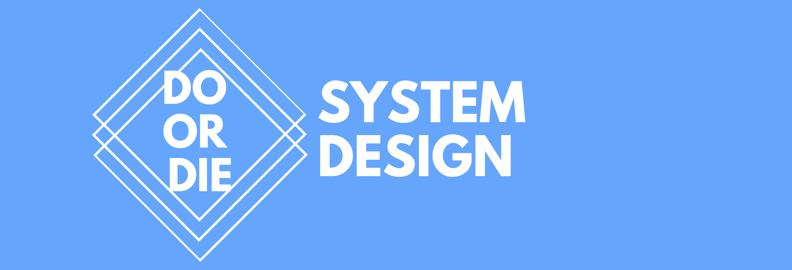

# System Design [40pts]

In the following section we will reflect on the design of our product. By the end of our System Design section, you will understand how we moved from our initial paper prototype to our [existing product](https://github.com/Team-Jag/Do-or-die-fitness-tracker#product-description). Before explaining the architecture of our system in detail, including the object oriented design of each of our key subsystems, we will first explain how we came to design our product based on the gap in the market that we were trying to fill. This includes our three key user groups, and their individual user stories. We will also explain and evaluate the design interface of our subsytems, and introduce potential areas for improvement. 

## Table of Contents
- [**Product Requirements**](#product-requirements) 
  - [Ideation and Concept Development](#ideation-and-concept-development)
  - [User Types](#user-types)
  - [Key Subsystems](#key-subsystems)
- [**User Requirements for Key Subsystems**](#user-requirements-for-each-subsystem)
  - [Desktop system requirements](#desktop-system-requirements)
  - [Web system requirements](#web-system-requirements)
  - [M5Stack system requirements](#m5stack-system-requirements)
- [**Architecture of The Entire System**](#architecture-of-the-entire-system)
- [**Object-Oriented Design of Key Subsystems**](#object-oriented-design-of-key-subsystems)
  - [Desktop design](#desktop-design)
  - [Web design](#web-design)
  - [M5Stack design](#m5stack-design)
    - [Back-end](#back-end)
    - [Front-end](#front-end)
- [**The Evolution of UI Wireframes for Key Sub-Systems**](#evolution-of-ui-wireframes-for-key-subsystems)
  - [Desktop UI wireframe](#desktop-ui-wireframe)
  - [Web UI wireframe](#web-ui-wireframe)
  - [M5Stack UI wireframe](#m5stack-ui-wireframe)
- [**Details of the Communication Protocols in Use**](#details-of-the-communication-protocols-in-use)
  - [Desktop and M5Stack](#desktop-and-m5stack)
  - [Desktop and web](#desktop-and-web)
- [**Details of the Data Persistence Mechanisms in Use**](#details-of-the-data-persistence-mechanisms-in-use)
- [**Details of Web Technologies in Use**](#details-of-web-technologies-in-use)
- [**Conclusion**](#conclusion)

## Product Requirements
Our [Do or Die fitness tracker](https://github.com/Team-Jag/Do-or-die-fitness-tracker#product-description) is an Internet of Things (IoT) product that we designed to operate across three different platforms; the M5Stack, the Web, and a Management Dashboard. 
### Ideation and Concept Development

<p align="center">
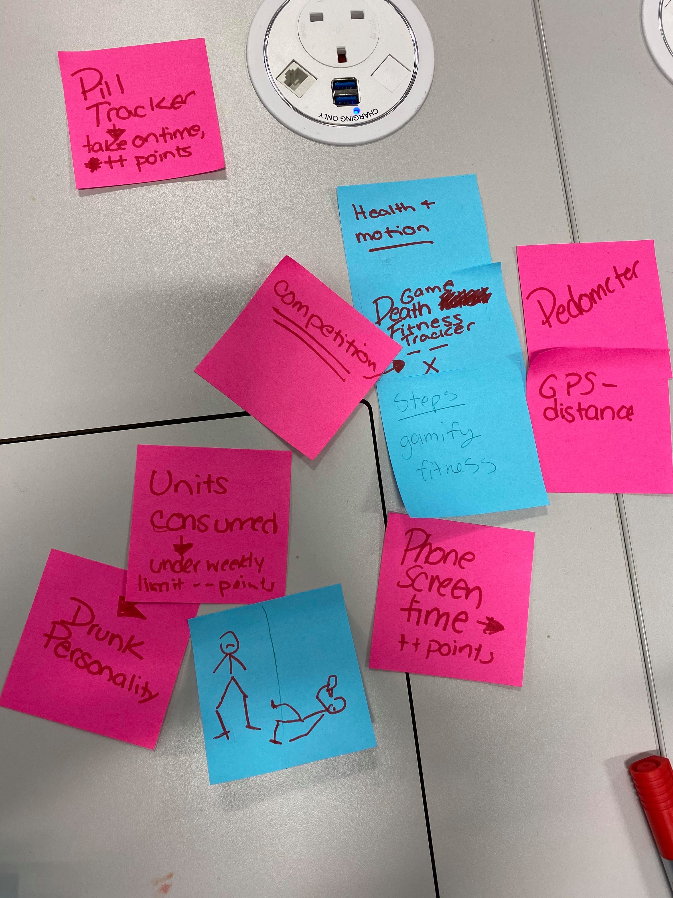
</p>

While initially explored a number of fun and potentially successful products, we came to the conclusion that each team member was keen to develop a product that focused on the improvement of user health. We kept health at the centre of our minds while exploring our design space, and deciding what had the most chance of success. We ultimately came to the conclusion that we wanted to create a gamified fitness tracker to promote a healthier lifestyle. When deciding what type of product to create, we took particular interest in the success of different games such as Pokemon Go, and the recent revival of the Tamagotchi. We felt that if we could combine our goal of having a fitness tracker, with the concept of a keeping a virtual pet on an Internet of Things (IoT) product, we would be addressing a gap in the market - likely very successfully. In recent years there has been a large push towards getting individuals active, which is something that we kept in mind during the ideation process. After several ideation cycles focused on the concept of health, we settled on the idea of measuring user step-count as a proxy for user fitness.

A key requirement for the success of this project is maintaining the end-user's motivation that goes beyond just meeting a daily step goal, as this would eventually become repetitive and boring. We recognized that this had the potential to lead to a fitness plateau as the user would walk enough to keep the Bean alive and no more, thus placing a ceiling on their potential benefit from our product. To solve this we introduced the idea of challenges, to make exercise closer to a game with concrete objectives and rewards, and introduce an element of competition which will further encourage end-users to use the product longer. We considered letting users themselves upload challenges and compete against each other, however with a large playerbase we thought this would create an overwhelming amount of challenges (a scaling issue), and also remove incentive to create challenges with a suitably difficult effort/reward ratio. At the end of the ideation and creation process, we felt that the concept of our [Do or Die fitness tracker](https://github.com/Team-Jag/Do-or-die-fitness-tracker#product-description) was not too ambiguous, nor too specific, and allowed for the perfect amount of growth and development when following an Agile development process. 

### User Types

After decided what we wanted Do or Die to look like as a product, we began exploring who who would use our system, and how they would use it. Ultimately, we came to the conclusion that we would have three main user groups: the Admin, Sponsor, and End-User. These three user groups ensured that our product had a user-centred focus, and defined our test cases and requirements that were the basis of the development of our system. Each of these user types will be explained in detail, as well as example user stories that we kept at the centre of our design process. 

Our first user group, and the centre of our product, is the end-user. This is the person that is using our product to get fit, invest time and energy into gaining health for the Bean thereby increasing their own health. This person will likely either be someone who is interested in getting active, but lacks the motivation. Or someone who is already active, and would like an extra challenge or an additional motivator to push themselves even further. Regardless of why they were using our fitness tracker, we knew that each user had to be able to do a number of things to see a benefit. This includes the ability to track their steps, know the current health of their Bean, enroll in challenges, and track their overall progress. The key theme of our end-user user type is that they are experiencing some type of challenge. Whether they are setting their own daily goals, or enrolling in challenges, they should be able to track their progress and see the adition of 'life' to the health bar of their Bean. This was the core concept underpinning our product, and what would ensure our success. 

Our second user type was a sponsor. This person was likely a local gym owner, or business owner, who was looking for exposure for their business. We imagined it more likely to be a fitness business, as that would work well with our product and the type of customer base that we were likely to attract. Sponsors should be able to create challenges for our users to enroll in, which would likely advertise their business in some way (i.e. 'The Bristol Gym Challenge'). This would generate a significant amount of exposure for local business. In return for completing a challenge, a sponsor would reward extra 'life' to the user's Bean. A sponsor must be able to create a profile on the web in order to create challenges, and they should be able to track the users enrolled in the challenges. 

Finally, in order to ensure the success of the product, we knew that we needed to have an admin user type. This person would be responsible for tracking the playerbase, the success of the product, or if we are loosing users. The admin would be the person responsible for deciding whether the product needs to be modified, or adapted based on these statistics. Moreover, the admin would be in charge of fixing any issues that may arise from the users and the sponsors. This may include the pedometer not working correctly, a user's inability to sign up to challenges due to an issue on the backend, or a need to change/delete a user's details. In order to ensure the success of the product, the admin must be able to view a number of statistics relating to the userbase. This includes total numbers of currently 'dead' users, weekly statistics, and monthly statistics. The admin must also be able to pull up an individual user's profile to be able to adequately address any issues. 

<table>
<tr>
  <th><b>End-User</b></th>
  <th><b>Admin</b></th>
  <th><b>Sponsor</b></th>
</tr>
<tr>
  <td>The user walks around with the M5Stack on his arm, which counts his steps, and displays the health bar of the Bean. The health bar is reflective of how much time the user has left</td>
  <td>The admin can utilise the management dashboard to track statistics of users, sponsors, and challenges in order to ensure the success of the product and see how others are interacting with the product</td>
  <td>The sponsor uses the website to create a profile, and set challenges for the average user to enrol them.</td>
</tr>
<tr>
  <td>The user can use the web to enrol in challenges set by sponsors, and view their total steps and health</td>
  <td>The admin can use the management dashboard to view issues set by users on the website</td>
  <td>The sponsor is able to use these challenges as a way to promote their business and brand.</td>
</tr>
<tr>
  <td>The user can increase the Bean's health by either completing challenges or walking</td>
  <td>The admin can use the web to track web traffic over time</td>
  <td>N/A</td>
</tr>
</table>

A further break down of the user stories can be seen in our [Gantt chart](Images/updated_gantt.png). However, the main ones are outlined in this use case diagram:

<p align="center">
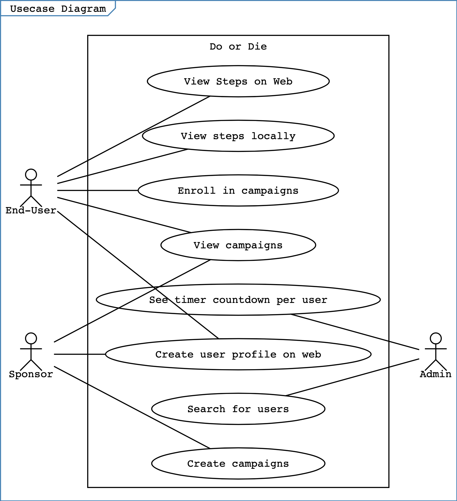
</p>

### Key Subsystems

Now that it is clear who are target users are, and how we saw them using our system, it is necessary to define the key subsystems that make up our product. Each of these subsystems became necessary to ensuring the success of Do or Die as a product: 

* **Internet of Things Device** : 
The key aspect of our product design was the IoT device, which was an M5Stack. This was an Arduino compatible device that we used to create a pedometer. The M5Stack will be worn on the user's wrist as a fitness tracker, and is capable of sending steps to the database. As it has a screen, it is possible to display the Bean and other statistics. This device worked well for our desired goals because it contains a gyroscope which can be used as a pedometer, and Wi-Fi capabilities to pull information from the central database.

* **Desktop Application** : 
In order to analyse the userbase, as well as store and have access to user data, we created a Processing application which functions as a back-end. We implemented a Managment Dashboard to be used by the Admin on the desktop application. The back end of this subsystem sends and receives requests from MQTT client topics, parsing to make sure request is not malformed, storing user, sponsor and challenge information in a central database, and visualising general consumer data such as total users of the app. 

* **Web Application** : 
Finally, to complement the M5Stack and allow the users and sponsors to enroll in challenges, as well as view their statistics more in depth, it was necessary to have a web application. On the website they can view things like their ranking across our users, their total steps, and can enrol in challenges. Sponsors can also use the website to create challenges.

Before explaining in more depth [how our subsystems work together](#architecture-of-the-entire-system), we will first explain how we used our user stories to develop the key requirements for each subsystem. 

## USER REQUIREMENTS FOR EACH SUBSYSTEM 
To break each of the three key subsystems down further, and before any substantive work began, we outlined the key requirements for each system in order to understand what was eventually necessary to develop a Minimum Viable Product (MVP). This also ensured each of the team members were aware of the key functionalities of each subsystem. These will be explored in turn, before we analyse the final architecture of our system, and finally each of the key components of our architecture.

### M5Stack System Requirements
The M5Stack is the primary device that the end-user interacts with, and for that reason we were mainly focused on the End-User group. In order to ensure that we implemented the end-user's stories, we split our requirements into the back-end and front-end to focus on both the accuracy of our product, and the appeal to the end-user. 

**Back-End**

* The end-user's main goal when using this product is to be able to track their fitness level, and for that reason the M5Stack must have a pedometer to be able to accurately count the end-user's steps.
* In order for the end-user's steps to be tracked between session, the M5 must be able to communicate with the server using the shared communication contract.

**Front-End**

* To ensure customer retention, the M5Stack must implement an enganging and appealing interface.
* As the end-user is interested in getting healthy and this relies on the user knowing how active they have been, the M5Stack should display a live step count.
* The M5Stack should display an adorable sprite (called Bean) to create an attachment with the end-user, and ensure long-term engagement.
* As the product has been gamified, the M5Stack must have a health bar which accurately reflects how much health the Bean has left.
* To reflect the user's success and ensure they continue to meet their goals, Bean's animations and general liveliness should reflect its remaining life (i.e. it should move less when it is closer to death).
* To allow for the user to know what goals they have, the M5Stack should display the challenges that the user is enrolled in.
* In order for the end-user to track their progress, the M5Stack should display the user's statistics.

### Desktop System Requirements

As explained above, the Desktop Application acted as the administration interface for data visualisation. It was developed to create a back-end to deal with sending and receiving requests. We also created front-end to track and visualize total users, sponsors and challenges currently available.

**Data visualisation UI (front-end)**

* In order for the admin to track user data, the front-end needs to pull flat totals from the database for current users, sponsors, and available challenges to draw accurate statistics.
* To allow for the admin to see relevant changes in the userbase in an intuitive way, the interface must be able to split this quantative data based on a time frame, showing changes over daily, weekly and monthly periods.
* If there are specific issues, the admin must be able to track them down. Therefore, the front-end interface must be able to look at statistics for any specific user, such as how much time they have left and global steps taken.

**Data processing back-end**

* To provide accurate statistics for the admin (front-end), the system must be capable of processing JSON requests efficiently from both the web application and the M5Stack.
* To ensure the admin retains control of the userbase and product, the back-end must also be able to insert new users, sponsors and challenges into the central database, while retaining this data in a persistent manner. 
* In order for the end-user to have an accurate step count, the system must be able to listen on the correct MQTT client topic for step updates for each user, and update records accordingly.
* To allow for the end-user to know how much health their Bean has left, the system also calculates the life time remaining for each user's avatar based on step updates and time elapsed and sends the required data back to any device that requests.
* To ensure that there is no discordant data between applications, data is only stored in this system and any data required by other applications will be sent by this system.
* To ensure that the sponsor's see success from their challenges, and to ensure that the user's remain motivated, the system should automatically add rewards if user has met required goals in any challenges enrolled.

### Web System Requirements
The web application acted as the primary interface for the sponsor to interact with our product. The end-user would also use this application to handle everything related to challenges and their profile. 

* Both the end-user and the sponsor must be able to log in to the website, thus the web application must be able to retain the username upon creation/login and in case of a sign-up send the new profile information to the server.
* To ensure that the end-user is able to access their profile and individual data, the website must send a request to the server for the user profile and and all his challenge and render that information. 
* In order for the end-user to personalize their account, the web must render a profile picture depending on the user name (the profile picture will be available on the webserver). 
* The end-user must be able to enroll in challenges. Therefore, the website must request all challenges from the server, render all of them (dynamically) and inform the server if a user has selected a challenge. 
* In order to ensure consistency across our system and for the user between their M5Stack and the web, the information requested and rendered under point i.a) must be updated regurarely (i.e. send a new request to the server every second and render the updated data on the screen). 
* To allow for the sponsor to generate new challenges, the website must have an input form for new challenges. The input of the sponser gets validated (e.g. did he complete all fields) and upon submission the new challenge will be sent to the server. 

## ARCHITECTURE OF THE ENTIRE SYSTEM
As has been outlined above, it is clear who our user groups are as well as how they will interact with each of our key subsystems and what each of the key subsystems must be able to do. However, to be able to deliver our user stories, and final product, we needed our architecture to send and store data: 

**Data Communication**
To ensure that each subsystem communicated in the same way, we developed a shared communication contract. Data such as step data moves between the M5Stack to the Desktop, and then the Desktop to the Web. We implemented this by using a MQTT broker, which is explained further in the [communication protocols section](#details-of-the-communication-protocols-in-use). 

**Data Repository**
To ensure that our data is persistent, we store the data in JSON files. These JSON files are stored locally where the Processing app is running, similar to a server. This process is explained and evaluated further in the [data persistence subsection](#details-of-the-data-persistence-mechanisms-in-use). 

However, before exploring each of these mechanisms in further detail, it is important to outline the overarching architecture of our system. Our system architecture uses a central controller API which communicates with the database, and receives and sends requests using MQTT protocol to communicate between different devices. To maintain separation of concerns, all data is accessed through an API public class which allows access to a private Database class for storage of persistant data, and requests pass through a multiple channels on the MQTT broker. By doing this, we ensure that the Web and M5Stack components never directly interact. 

Communication between devices was devised to be as simple as possible to avoid unecessary complexity, with the concept of a common contract of User, Challenge and Sponsor classes being consistent across all devices to make the project as maintainable as possible. Our shared contract will be explored in further detail [below](#details-of-the-communication-protocols-in-use). Unit testing each subsystem allowed us to be confident that individual components were working correctly, which allowed for ease of integration during each sprint. 


The above diagram demonstrates dependancies and communication between all devices of our project. Every request passes through the database API on the Processing app, and when needed recieves a request to pull information from the database. No device has access to storage apart from the API. This is a security concern as it allows only valid requests to alter files in persistent storage, and it is a modularity concern as there is a strict contract devices must adhere by to add or request data.

**System Validation** 
It was important to be sure that every aspect of our system had the correct purpose in regards to the specifications defined by our user stories. We needed to make sure the product we were building was the correct solution defined in our ideation stage (we built a step counter to motivate users to be challenged and more fit). Our subsystem specifications for each device (web, desktop and M5) were built to solve each use case defined in user stories. By going from the original ideation stage and taking a user-centric approach to designing our product, we have ensured that we designed the product right for each use case. We established use case goals for each user story. Our product was therefore internally validated, as the use case goals were clearly defined and expressed in the form of requirements, which we then proceeded to implement. We demonstrated validation of the system at each step of the development cycle, by ensuring the features we were adding conformed to the user specification we laid out.

**System Verification** 
This refers to correctly implementing features based on subsystem specifications as defined by our user stories. We verified our product via agile Github practices (mentioned in System Implementation and Evaluation sections) to make sure subsystems interacted correctly and we had a full working product. By following specifications laid out during the validation state, we made sure each subsystem was designed to conform to our shared contract, and each feature was tested extensively using local unit tests. 

## OBJECT-ORIENTED DESIGN OF KEY SUBSYSTEMS
In the following section, we will reflect on the final design of each of our key subsystems at the conclusion of our final sprint. While our [initial UML diagram](Images/first_uml.png) from one of our first meetings was limited, during each sprint the object oriented design of each subsystem changed depending on the tests that we had passed as well as failed. In this section, we will explain the final design, while considering where there could be room for improvement during future sprints.

### DESKTOP DESIGN

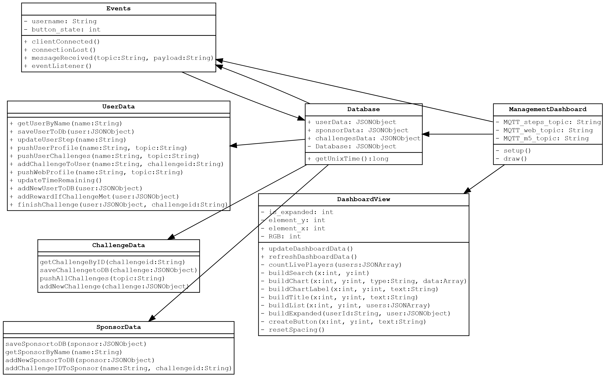
The above diagram shows dependencies and relationships between classes in the Processing app. 

Key classes for desktop app include:

* [**database**](../desktop/management_dashboard/data.pde) - this is a private class which deals with writing and reading persistent data stored on disk. Encapsulation of this class makes the back-end modular and allows altering of the data classes and other elements of the program without needing to change database. The database class follows the Liskov substitution princple, as it does not care what type of data request comes in (between sponsor, user and challenge types) and abstractly performs operations on the persistent data files.
* [**data classes**](../desktop/management_dashboard/data.pde) - acts as the database API that retrieves and updates user, sponsor, challenge information (with each data type having their separate APIs respectively to ensure encapsulation of database class). Having separate classes for each type of data allowed for modularity when modifying request types was necessary during the project. Request types and the data types requested are stored as constants (static final Strings) to ensure the communication contract is followed precisely.
* [**events.pde**](../desktop/management_dashboard/events.pde) - receives and processes MQTT payloads, passes on information into view to rebuild UI with every new request, and into the database API to either publish (pull type requests) information into MQTT client topics or update (push type requests) the database. This class also contains event listeners for buttons and lists in the UI, and any time an event occurs (such as data being added) the view class is refreshed. This was done to enable changing statistics to be visualised in real time as opposed to after a restart.
* [**tests.pde**](../desktop/management_dashboard/tests.pde) - the test class contains unit tests to ensure edge cases are handled gracefully. This is necessary for future integration, to have confidence that all requests work correctly.
* [**view.pde**](../desktop/management_dashboard/view.pde) - this class deals with data visualisation from parsed user.json, challenge.json and sponsor.json. Contains helped functions for building the UI, for building expanded lists and building charts using local JSON files obtained by requesting data from the respective APIs. The class is by necessity accessed by Events which contains listeners for incoming requests (this updates view in real time when new data is added) and for buttons in the UI (for interactivity and selecting what information the admin wants).

### WEB DESIGN

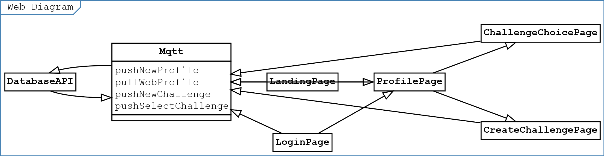

For more detail on web technologies see section **1g.** below.
React is ideal to implement object oriented design. Our website consists of functional components (classes - one for each site/view) and an MQTT class which is integrated into the different views.

* **MQTT Class:** This class handles all communication with our "server" and the associated rendering. You will find a call for the MQTT class in all the following components. The class:

  * encapsulates - it hides the detail of the server communication from the other components
  * acts abstract - with a simple interface that can be called by all components
  * inherits its basic methods from the react components
  * is polymorphic - it can handle all sorts of data: from profile to challenge data  
* **Landing Page:** Contains all the static content and the MQTT instance for creating a new profile
* **Login Page:** Contains the static UI + a MQTT instance to handle the Login
* **Profile Page:** Contains a MQTT instance which renders the full profile incl. a dynamic profile picture and  the challenges the user has signed up for
* **Challenge Choice Page:** Contains a MQTT instance which lets the user sign up for challenges
* **Common static components such as headers, navbars or footers** which can be integrated in all of the views

### M5STACK DESIGN

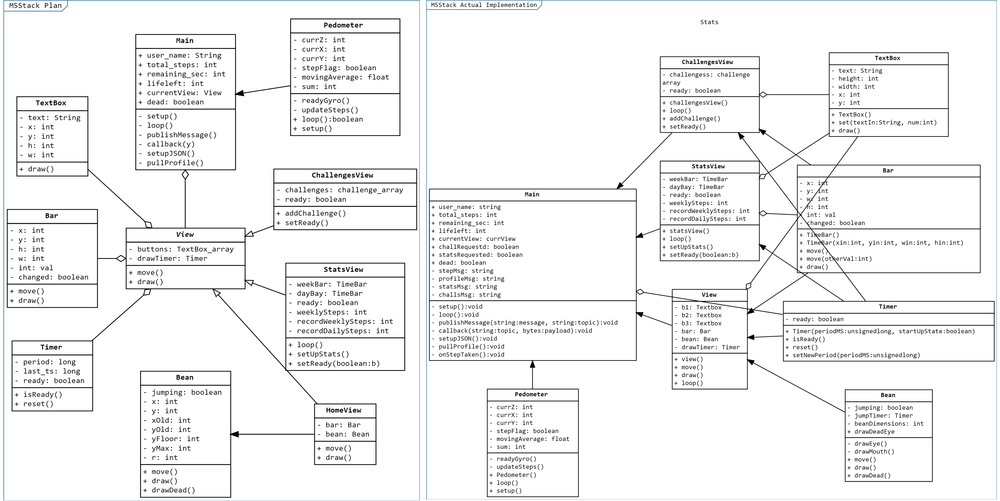
On the left we show what our plan was for our M5Stack design, on the right we show what the end product actually ended up looking like. Clearly Arduino is not the best for Object Oriented Design. Now we will explore the classes implemented in the front and back-end of the M5Stack, explaining as we go how we went from the design on the left to the implementation on the right. 

#### Back-End

Since our M5Stack is a non-persistent machine with well-developed animations, our back-end Classes are straight-forward. In the back-end, we need to read in the data from the Gyroscope and use it to detect when the user takes a step. By counting steps we are able to approximately estimate the end-user's fitness level and reflect it in the Bean's health bar (calculated based on time) which is the very essence of our product. To do this, we need to send and receive the JSON messages to the persistent database in the form that was agreed upon in our shared contract. This allows the M5Stack to be a non-persistent machine by pulling and pushing all the necessary data from and to the Desktop server.

* [**Pedometer.h:**](../m5/Main/Pedometer.h) This class acurrately counts the steps taken by the user using the Gyroscope inside the M5Stack.
Since this was a required component of our minimum viable product, we had to develop this as quickly as possible so instead of designing a gyroscope data analyzer ourselves, we resorted to an external library for this feature (MPU9250 Basic Example Code by Kris, Modified by Brent Wilkins July 19, 2016).
This allowed us to quickly bring step-tracking online without spending too much time on it, and it gave us the time needed to develop more efficient communication systems and more dynamic animations as detailed below.
That being said, this pedometer is by no means perfect, sometimes counting a single step twice or mistaking a simple twitch of the arm for a step. Which means we would most likely have to write our own more accurate version before releasing this product to the public.

* [**Main.ino:**](../m5/Main/Main.ino) This is the main class, the loop() is running at all times in the M5Stack. It publishes and reads messages on the appropriate MQTT Topics, and does so by serializing and deserializing JSON messages using the ArduinoJson.h library. Once a JSON message is deserialized it is placed in the correct Class.
For example, data relating to the challenges will be stored in the ChallengesView object, whereas Statistics data will be stored in the StatsView object. Once all data is correctly handled, Main.h selects which of the Front-End View objects to draw(), according to the screen requested by the user, through the use of the M5Stack buttons.
This class was heavily worked on in every single sprint, going from a simple wrapper class for our Pedometer to a fully fledged communication class.
When implementing this class, we did not prioritise the readability of the code and rather focused on making it work. This was due to our limited timeline, lack of experience with the language, and general focus on outcome rather than good programming pratctices. It may have been a better idea to separate the communication methods from the front-end View handling methods, keeping them in two different classes rather than one. 

#### Front-End

Initally our idea for the M5Stack Front-End Classes was to have a central abstract class View which would execute all of the printing and drawing to screen. We quickly discovered that things like abstract classes, inheritance and polymorphism were too hard to implement effectively and in Arduino so the 'View' abstract class does not actually exist in our code. However it is still useful to conceptualize our View classes as belonging to a figurative abstract class since they have the same methods and attributes.

<p align="center">

</p>

* **[View.h](../m5/Main/View.h) ([ChallengesView.h](../m5/Main/ChallengesView.h), [StatsView.h](../m5/Main/StatsView.h)):** These classes draw the Home screen, Challenges screen or Statistics screen respectively using a composition of their child module Classes (TextBox.h,  Timer.h, Bar.h, Bean.h). These are effectively aggreate classes which combine the move() and draw() functions of our component classes below.
In our design, we wanted this to be a interface which we then called in Main.h to draw the appropriate View object using the strategy design pattern. However we struggled to do this effectively in Arduino and we ended up falling behind schedule.
As we were following an Agile development process, we had to adapt quickly in order to maintain our minimum viable product. Therefore, we made the decision to switch to a more crude design where each of these objects is stored directly in Main.h, and then the correct draw() method is called using a simple set of if statements.
While this new design does not follow good coding practices, it allowed us to get back on schedule. So we learned that sometimes when working in a team it is important to swallow our pride, accept that something is too difficult for us to learn quickly, and change a great-looking design that we cannot implement to an lower quality design that we can actually deliver on time.

* [**TextBox.h:**](../m5/Main/TextBox.h) This class draws a simple box with given text at the bottom of the screen, used to explain what each M5Stack button does in each View. 
We understood from the start that these "button descriptions" were required for user clarity, we had them even in our first UI wireframe. 

* [**Timer.h:**](../m5/Main/Timer.h) This class implements a simple timer. We use this in each View class to control the refresh rate of our front-end frames. It is also used in Main.h to set how often we update the user information by sending a 'user_profile' type request to the Desktop Server.

* [**Bar.h:**](../m5/Main/Bar.h) In this class, we draw a simple horizontal progress bar, used to visualize the "Health" left in the Home view, the progress of a challenge in the Challenges view, and how close a user is to their personal record in the Statistics View.
We ended up using a lot of progress bars in our View objects because the M5Stack graphics library provides a simple way to create such progress bars and these bar charts provide an effective way to communicate to the user how well they are preforming.

* [**Bean.h:**](../m5/Main/Bean.h) This is used in Home view to draw our main animation: a cute-looking sprite named Bean which jumps around the screen and changes its facial expressions. The movement speed, jumping height, and jumping frequency are all dynamically calculated based on the "Health" of the Bean. The health, which is the remaining time the Bean has left, is calculated by the Desktop server. We spent a lot of time optimizing this class' animations, as they help the user grow attached to their Bean, and therefore motivate them to live a health lifestyle. 


## EVOLUTION OF UI WIREFRAMES FOR KEY SUBSYSTEMS
After our initial [ideation process](#ideation-and-concept-development), we created our first paper prototype for how we saw users interacting with Do or Die on the M5Stack. Our [User Story video](Images/paper_prototype_video.mp4), developed during the prototype phase, demonstrates how we imagined the end-user interacting with the M5Stack and Do or Die. We undertook the design of our UI wireframes in an iterative fashion. We initially planned how we saw the M5Stack working using a paper prototype, then we received feedback on the design, before reacting to this feedback. Once we began implementing our code, we added in the 'do' phase to our work cycle, that is after planning how we wanted our UI to look, we implemented it in code before seeking feedback and then responding to it. 

The key aspect of the evolution of our UI wireframes, and the design of our system, came from user evaluation. Before beginning any work on the implementation of our system, we used a few techniques to evaluate our paper prototype. One technique, and the most useful, was the use of ["Wizard of Oz" prototyping](https://searchcio.techtarget.com/definition/Wizard-of-Oz-prototyping).  Using this method, we had a script that we followed to provide directions to the user, a fellow student who acted as the end user, and a member of our team that acted as the "wizard" and simulated how we expected our final product would preform by using our paper prototype. 

<p align="center">
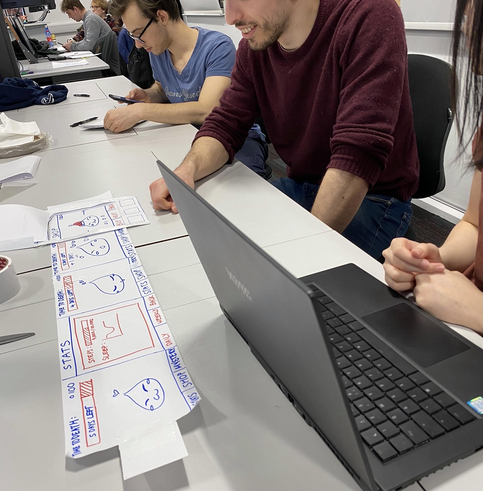
</p>

From our Wizard of Oz prototyping session, we decided that our first plan for the UI wireframe would need to be simplified further. As we had drawn the M5Stack on a large piece of paper, it was easy to include a number of details that likely would not be visible on our final screen. Moreover, we received feedback that our plan for how to display statistics was not clear enough and we decided that we would have to alter the way that we chose to display this information on the M5Stack. This was process was useful in allowing us to realize how a user would likely interact with our product, including which buttons they would press and what they would expect to happen. Additionally, this allowed us to learn more about our potential audience and what they would expect to get from this product. This included more animation for the Bean, and that they were least likely to use the shop. With this information, we were able to accurately prioritise certain user stories in terms of when they were implemented during the sprint, as well as analyse the UI of our M5Stack. 

After this initial paper prototyping session and Wizard of Oz evaluation, we began to design the UI of our two other key subsystems (the management dashboard and web application), as well as respond to the feedback we received on the M5Stack. This included prioritising the implementation of the health bar, ensuring that the bar graph was clear, and then implementing animation for the Bean. Moreover, after one of our first 'Check' cycles of developing the UI interface across all three subsystems, we received feedback from our peers that we should have a consistent colour scheme to ensure that it felt like one cohesive product. This colour scheme is represented by each subsystem, and can be found in the [Documentation](../Documentation/Colour_Scheme.txt) section of our Github. 

Before beginning to do any of the implementation on the M5Stack, we decided to implement an updated version of our [paper prototype on Processing](https://github.com/Team-Jag/Do-or-die-fitness-tracker/tree/ui-wireframesIntroduction/Portfolio/M5StackPrototype). 
<p align="center">

</p>

After undertaking user-centred evaluation with some of our peers using the prototype implemented on processing, we realized that it was better to revert to our initial design of having a bar chart to demonstrate health. This made it easier to visualize, and we knew that it would be more difficult to see the time ticking down on the M5Stack. Importantly, we decided that the M5Stack would only request the user profile every five seconds. As the time remaining, which influences the time until the Bean dies and the health bar, is calculated by the database this could lead to potential gaps. Moreover, we received feedback that it was better to use textboxes to say what the buttons did rather than images, which we implemented in future design cycles. Finally, in future design cycles as we shifted to focusing on the steps for our initial version 1.0 release, we knew that it was important for the user to see a live step count on the screen. This took the place of the currency, and ensured that we kept the pedometer at the centre of our design process. 

Ultimately, this influenced the design of our other subsystems. We shifted things such as the user's ranking, and the exact number of seconds left, to the web. Due to the fact that the web has a bigger interface, this allowed us to include more specific feedback there. From user testing and watching users interact with our system, we knew that this was a better design decision. Mainly due to the fact that we prioritized keeping the M5Stack's interface as simple and clutter free as possible. 

Below we will compare the initial UI wireframes for each of our key subsystems, with their final appearance. We will also analyse potential areas for improvement, and how we came to make certain design decisions. 

### M5STACK UI WIREFRAME

<p align="center">
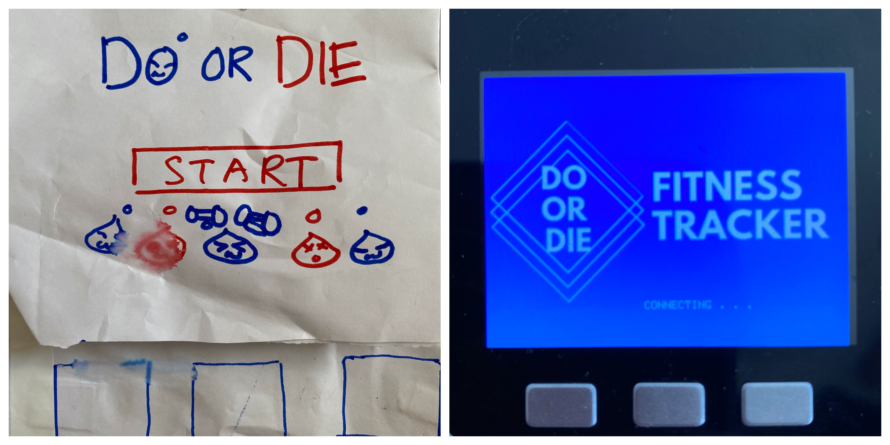
</p>

The starting screen was replaced with a more professional logo, following user feedback.

<p align="center">

</p>

From the initial UI wireframe, we designed and animated a simple but responsive sprite. The screen was decluttered to allow the focus on the sprite, based upon feedback we received during the user testing session.

<p align="center">

</p>

The stats screen was implemented according to the UI wireframe, however we have not implemented the sleep detection feature due to its dificulty to develop. Therefore, different statistics have been displayed.

<p align="center">

</p>

Initially our UI wireframe included a shop feature, however after adding a third user type (the Sponsor) we shifted our focus to implementing the challenges feature instead. The shop feature remains a valid possible future feature as dicussed in [Project Evaluation](ProjectEvaluation.md).

### DESKTOP UI WIREFRAME

To make the 

**Original** multi-tab wireframe design for desktop UI *(left)*, and **updated** single-tab wireframe design *(right)*:<br>

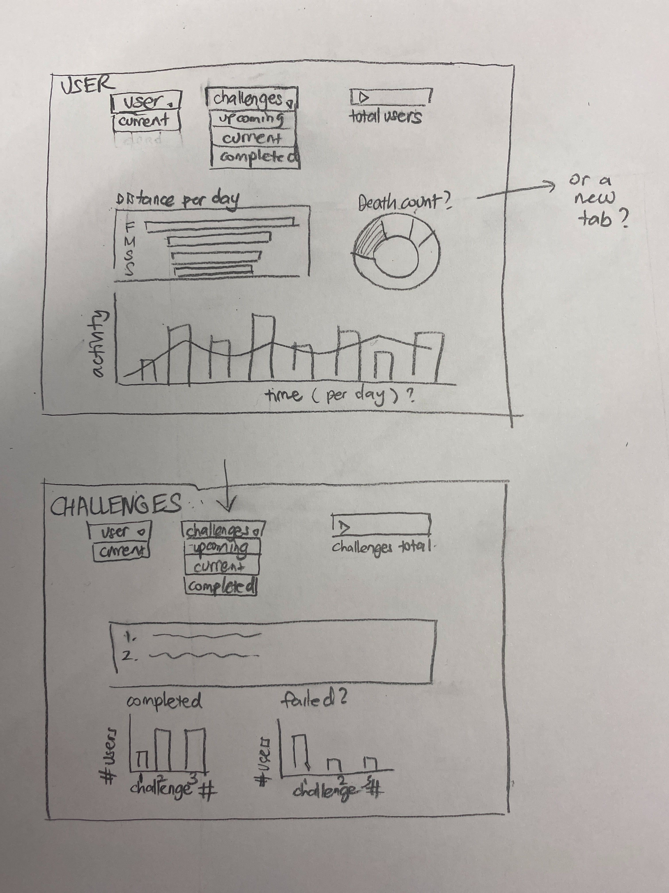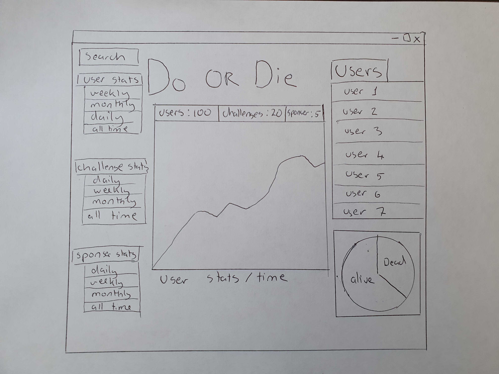<br>

We decided on the single-tab design to simplify the dashboard UI and not have to create new graphs in different tabs, as originally shown by the first design. We picked line graphs to visualise total count of users, sponsors, and challenges respectively to best show traffic over time. A pie chart was used to easily see the proportion of current users that are alive, and bar graphs were used to quickly compare the amounts of users, sponsors, and challenges currently active.
<p align="center">
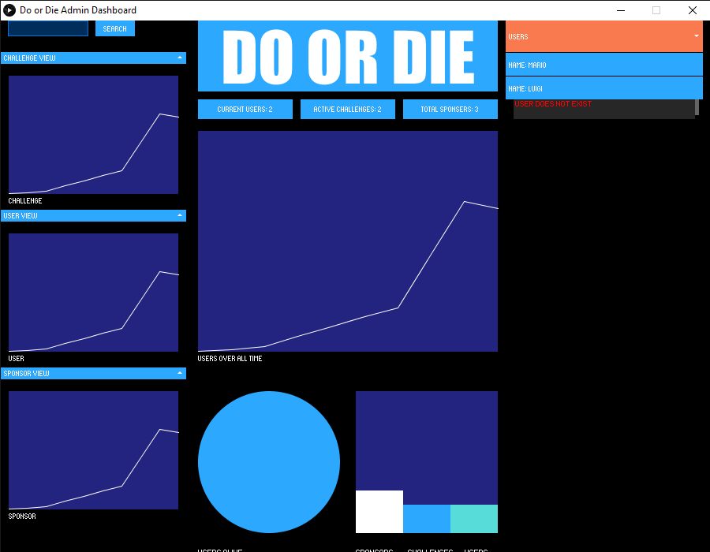
</p>

Pulling up a user profile by either using the search bar or dropdown list, an error message to show if a user does not exist. The search bar is important, as when the playerbase grows it may become unreasably difficult to find a specific user using just the dropdown list.<br>
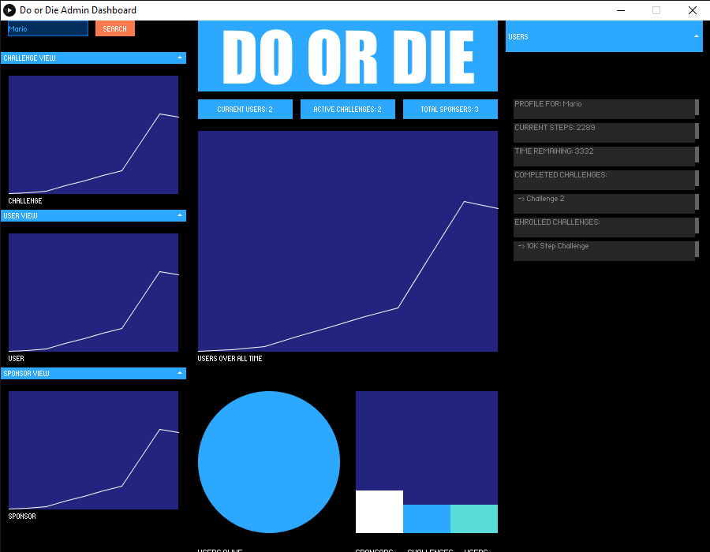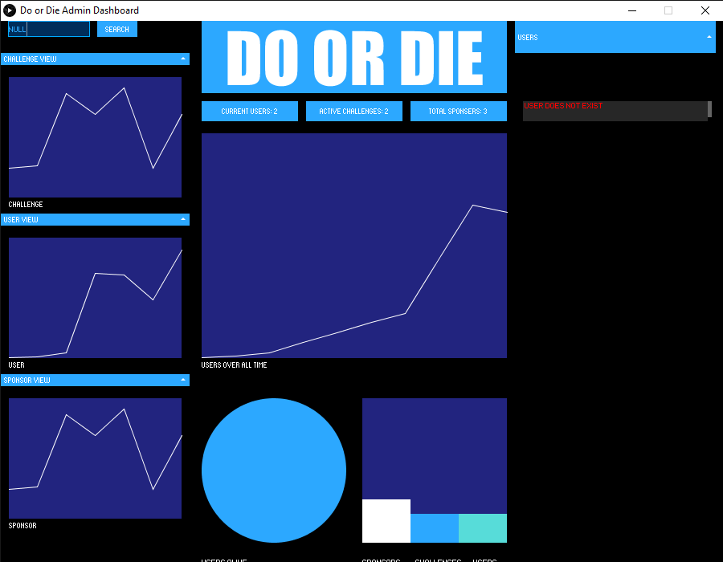

Selecting a specific statistic from UI to allow data to be viewed on different time frames:<br>
<p align="center">
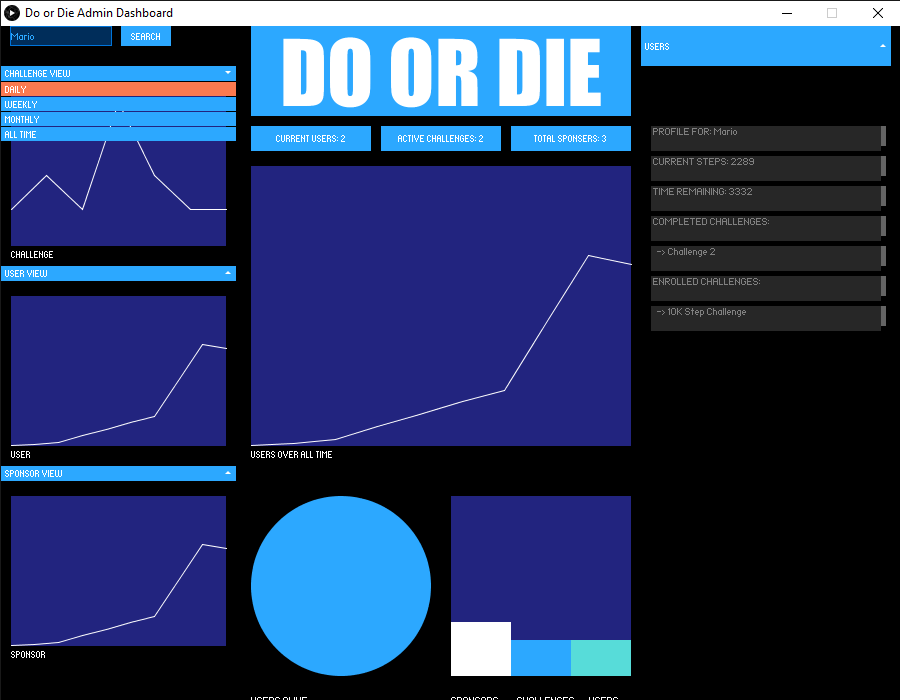
</p>

Different selected charts showing data over time for each parameter, such as users, sponsors, challenges in an intuitive way.<br>
<p align="center">
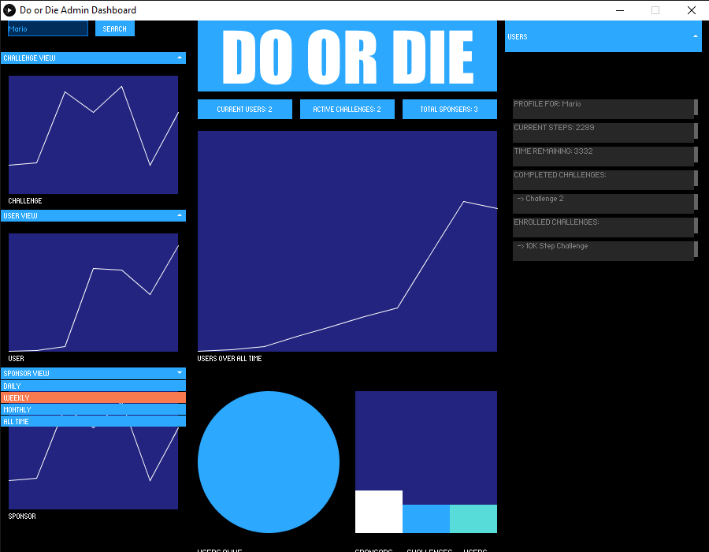
</p>

### WEB UI WIREFRAME

Original web wireframe design for desktop profile in comparison to the new, simplified but dynamic profile page. The end-user can choose from several profile pictures, steps, time and ranking get updated once per second. <br>
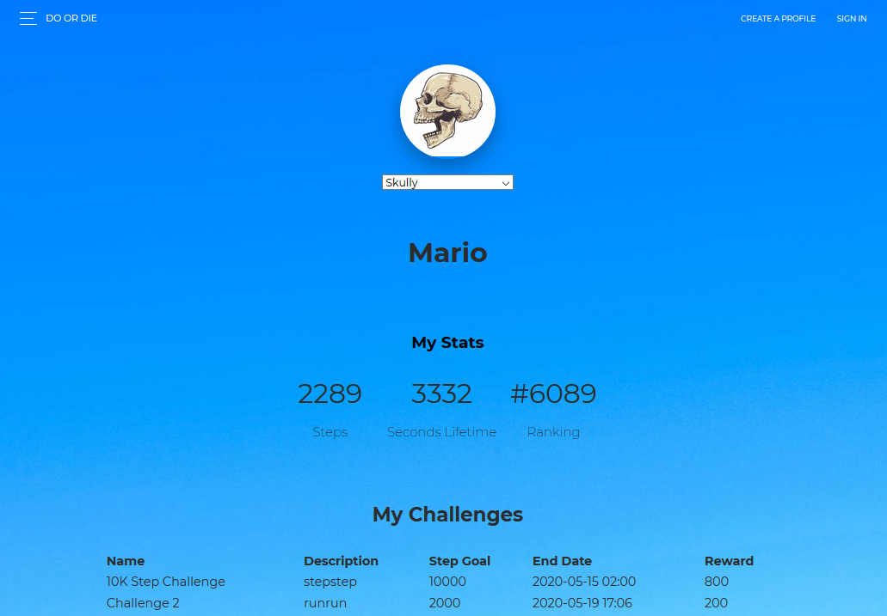

An initial sign-up screen draft next to the final sign-up screen, with sponsor checkbox. Sponsors will be forwarded to the create challanges page, users to their profile page.<br>
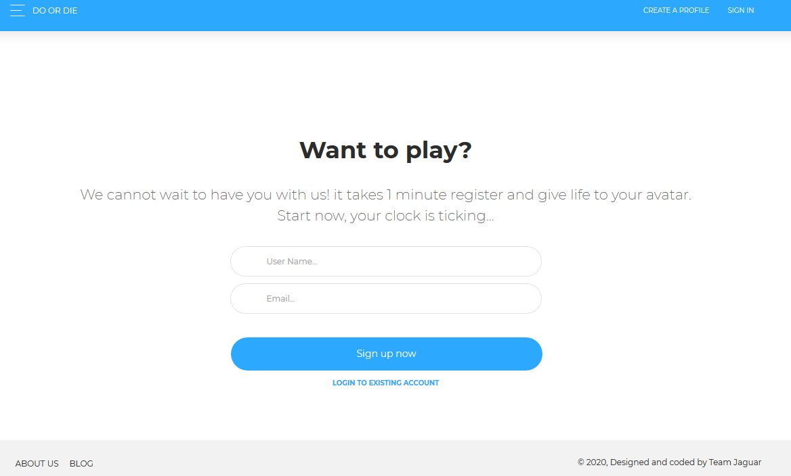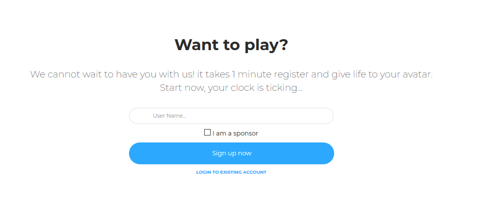

As we have now outlined the key features and design of each of our subsystems, we will detail and reflect on the other key features of our system's architecture. 

## DETAILS OF THE COMMUNICATION PROTOCOLS IN USE
Our IoT product was developed utilising the M5Stack platform, as a result of this, we utilised WiFi connectivity to allow for communication between our subsystems. This allowed for data to move from the web to desktop, M5Stack to desktop, and desktop to both the Web and M5Stack. In order to allow for this, we used MQTT (Message Queue Telemetry Tansport) as our communication protocol rather than something like HTTP web services. We made this decision for a few reasons:

* As HTTP is a synchronous protocol, the client is required to wait for the server to respond. On the other hand, with MQTT the client connects to the broker and subscribes to the message "topic" in the broker. The MQTT is able to receive all messages from the clients and route the messages to the relevant clients. This allows for us to communication across subsystems at the same time, which is important to separate the web and M5Stack clients.

* HTTP is a one-way connection, this means that the client (ie. our M5Stack) is not able to passively receive messages from the server. By utilising the MQTT protocol, the client can subscribe to the topic and receive all messages. This allows for real-time updated data from the server to the client, including the updated health data. 

* MQTT allows for scalability of our product, when there are a number of devices connected across the platform. This is due to the fact that it utilises reduced network bandwith to move the data between subsystems, which would then lower operation costs. As a key aspect of the design of our system is the maintaibility of our product, we felt that this was an important decision. 

* MQTT has become the standard for IoT communication, due to its flexibility and efficiency which made it an easy choice. As responses are received virtually instantaneously, it is the ideal choice to send data such as the user's live health bar (this is particularly useful in accurately showing when the user's Bean "dies"). 

To implement the MQTT communication protocol in our IoT product, we used [HiveMQ](https://www.hivemq.com). Our team established two topics, 'doordie_web' and 'doordie_steps'. Only one request type uses 'doordie_steps', which is detailed below in the communication protocol section.

Due to variability of payload attributes and sizes (especially concerning challenges), we made the decision to make a unifying request "type" parameter. For almost all request types, we chose to include a "user" parameter. Together, these two parameters allow our subsystems to ignore all messages in that topic unless there is an exact match of both parameters. Our shared contract, which was a list of all valid request types made between devices is found in [MQTT_request_types.txt](/Documentation/Mqtt_request_types.txt). This shared contract ensured clear communication between team members working on the different subsystems. We will expand on the key communication protocols and the request types below.

### DESKTOP AND M5STACK

The 'push profile' request type was the main message pushed to the M5Stack. As a stateless device, the M5 doesn't store any data and instead receives it from the server in real time by sending a 'pull profile' request and receiving this request every 5 seconds. As a result of this, we had to keep the size of this request small so that it could be sent frequently without flooding the MQTT topic (which would become more of an issue with multiple users). Therefore, instead of sending all the user's data in one large JSON package, this request only sends two key fields: 'total steps' and 'remaining seconds' of the Bean. The remainder of the user data is sent to the M5Stack using the other request types 'push user challenges' and 'push user stats'. These are called only when the user requests to see such data by going to the respective screen on the M5Stack. Structuring our request types in this way reduces the load on our architecture to a level low enough that it can be handled by a small server on a personal computer. Therefore allowing us to deliver a minimum viable product without having to use larger servers.

To send a user's profile data to the M5Stack from the database:

```
{
     "type": "push profile",
     "user_name": "Mario",
     "total_steps": 2200,
     "remaining_sec": 2000
}
```

This is only sent when M5 sends a request to the MQTT broker:

```
{
     "type": "pull profile",
     "user_name": "Mario"
}
```

Processing sends all challenges a user is enrolled in to be updated on their M5Stack:

```
{
    "type": "push user challenges",
    "user_name": "Mario",
    "challenges": [
    {
        "challenge_id": "1",
        "challenge_name": "10K Step Challenge",
        "description": "stepstep",
        "end_time": 1589500800,    
        "step_goal": 10000,
        "reward": 800
    },
  
    {
        "challenge_id": "2",
        "challenge_name": "Challenge 2",
        "description": "runrun",
        "end_time": 1589500800,
        "step_goal": 2000,
        "reward": 200
    }]
}
```

This is sent when the M5Stack requests the challenges of the user:

```
{
    "type": "pull user challenges",
    "user_name": "Mario"
}
```

To update the statistics of the user on the M5Stack:

```
{
     "type": "pull user stats",
     "user_name": "Mario"
}
```

The database uses the following request type to send stats to the M5Stack:

```
{
    "type": "push user stats",
    "user_name": "Mario",
    "daily_record": 10000,
    "weekly_record": 39000,
    "weekly_current": 18032
}
```

The M5Stack uses this request type to increment one step in the database, but there will be no response from the database. It is only for this request type that the 'doordie_steps' topic is used, as we expect steps to be sent every second. This allows for scalability of our product as the number of users increases:

```
{
     "type": "push step",
      "user_name": "Mario"
}
```

### DESKTOP AND WEB
To ensure that data is only stored in the database, the web has to fetch and parse JSON objects from the MQTT topic (doordie_web) and build dynamic pages accordingly when viewing user profile, challenges enrolled, or all challenges. The profile page and the challenge selction page require logins to fetch user respective data (based on "user_name"). For adding user/sponsor profiles, all data is entered by the user (user_name, and user_type sponsor is determined if the user checks the box "I am a sponsor") and joined_date (in linux epoch time) is automatically generated by the website, and sent to the database. This ensures that data does not need to be stored in the web.

```
{ 
 "type":"push new profile",
 "user_name":"Mario",
 "user_type":"sponsor",
 "joined_date":1587980814845
}

```
The web requests a user profile from the database. Note that we do not validate the password in our prototye, so user data and pofile information is not secured.

```
{
    "type": "pull web profile",
    "user_name": "Mario"
}
```

The database sends the complete user data (challenges, total_steps and remaining_sec) back to the web. This is used both to update the profile page every second with the newest step count and time remaining. But used on sign-up to check if a profile already exiists (if a user name is not used yet, the total_steps, remaining sec and challenges fields will contain null values.

```
{
    "type": "push web profile",
    "user_name": "Mario",
    "total_steps": 2200,
    "remaining_sec": 2000,
    "challenges": [
    {
        "challenge_id": "1",
        "challenge_name": "10K Step Challenge",
        "description": "stepstep",
        "end_time": 1589500800,    
        "step_goal": 10000,
        "reward": 800
    },
  
    {
        "challenge_id": "2",
        "challenge_name": "Challenge 2",
        "description": "runrun",
        "end_time": 1589500800,
        "step_goal": 2000,
        "reward": 200
    }]
}
```

To view the total challenges currently available, the web sends a simple request for all challenges:

```
{
    "type": "pull all challenges"
}
```

The database sends all current challenges available to the web:

```
{
    "type": "push all challenges",
    "challenge": [
    {
        "challenge_id": "1",
        "challenge_name": "10K Step Challenge",
        "description": "stepstep",
        "end_time": 1589500800,    
        "step_goal": 10000,
        "reward": 800
    },
  
    {
        "challenge_id": "2",
        "challenge_name": "Challenge 2",
        "description": "runrun",
        "end_time": 1589500800,
        "step_goal": 2000,
        "reward": 200
    }]
}
```

When the logged-in sponsor adds new challenges, all fields, which are required, are entered by the sponsor and will be sent to the database with the following request type:

```
{
    "type": "push new challenge",
    "challenge_id": "3",
    "challenge_name": "Challenge 2",
    "description": "runrun",
    "end_time": 1589500800,
    "step_goal": 2000,
    "reward": 200
}
```

When the logged-in user selects a challenge, there is no response from the database:

```
{
    "type": "push select challenge",
    "user_name": "Mario",
    "challenge_id": "1"
}
```

This set up allows for a working prototye, however user data is not secured. In future work password protection should be implemented to protect user data. Also, this set up is dependent on the website retaining the user_name variable state after login/sign-up to rednder all other pages. If the user uses the browser-native back or refreshes buttons the page will relaoad (instead of being redirected) and the user-name variable information is lost in the current set-up. In a next step the web application should make use of cookies to retain a session ID, which would be used as a reference in communicating with the "server". This cookie would persist in case of a refresh, thereby retaining the previous available data and allowing the "server" to only send user data if the user has been authenticated earlier in a session.

## DETAILS OF THE DATA PERSISTENCE MECHANISMS IN USE

Each user, challenge and sponsor is stored as a JSON object to allow for easy parsing and sending of payloads. The JSON format was used because parsing libraries exist for all devices, which allowed more time for development of the product logic as opposed to needing to parse JSON. 

In order to allow persistence we used [users.json](/desktop/management_dashboard/data/users.json), [sponsors.json](/desktop/management_dashboard/data/sponsors.json) and [challenges.json](/desktop/management_dashboard/data/challenges.json) files to permanently store respective data. This permanent data storage allows to separate the API from having to worry about how the data is stored or if data will be lost when the software crashes. This format allows the central server to send an entire user profile when receiving a request from the M5 or web device to pull a profile using the data API. To emulate a relational database, each user and sponsor object contains a challenges_id array which contains all the ids of currently enrolled challenges. Challenge_id array parameter is used to refer to enrolled challenges from challenges.json in order to keep payload lengths below the MQTT maximum. Similarly, each sponsor object also contains a challenge_id array (foreign key that refers to challenges data). Additionally, data will only be accessed when required (processing requests or updating user remaining health). This structure would ideally be implemented in a SQL relational database to increase speed and maintanability, as mentioned in project evaluation.

M5 device is stateless therefore does not store information locally apart from created variables such as the username, which is required to pull data from the database when the M5 first starts up. These are then pulled from the database via a pull user profile request type. Keeping the M5 stack stateless allowed for more modularity and reliability of the system, as even if the device breaks (which is a significant risk considering it is used for fitness and will be physically moved a lot) it can be replaced without loss of user data. If the device is stolen or lost, the user data is still stored on the central server and not the device, which means it can be removed and not leak information on the M5 stack. 

## DETAILS OF WEB TECHNOLOGIES IN USE

Our website is react based and built on top of a simple react/bootstrap template.
The choice for these technologies was driven by some key needs of our website/team that ultimately led us to choose this set up:

* **Ability for integration of MQTT commuication protocol:** When looking into the different framework we realized that the script Tom provided us for the MQTT communication could be easily reused and integrated into all major Javascript based frameworks (e.g. Angular, React, Vue).
* **Ability to dynamicially refresh content on a regular basis in an easy way:** React turned out to be the obvious candidate to satisfy this need: Its logic is centered around an app state, with components getting rerendered every time the state changes. That way we could display a dynamic step / lifetime counter which would change in real time without refreshing the page.
* **Availability of UI templates for rapid but beautiful prototyping:** React is currently [the most widely used](https://hotframeworks.com/) web framework, so there were plenty of templates available. We chose a [free template by Creative Tim](https://demos.creative-tim.com/now-ui-kit/index.html), which included some basic UI components such as a navigation and a profile page and would allow us to build rapid prototypes without bothering about the details of styling and navigation.
* **Support for Object Oriented Design:** To support our object oriented design we were looking for a framework that supports the use of a strong object oriented design. React components are ideal to build class based software (see chapter 1.b).
* **The MQTTclient Class:** Every page needs to be able to send or receive json messages, usually both, to and from the MQTT broker, so we have implemented an MQTT class which handles all data to prevent repetition in the design of each page. As the incoming json messages over the broker for the web profile are the most flexible in nature out of all pages, the MQTT class has conditional rendering dependent on the internal state of the class. The MQTT class running on a given system listens to incoming messages based on the username so if another user is accessing the site from elsewhere, there is no mismatch of data between the sessions and each user won't interrupt the others navigating the website. This was designed in order to be scalable, and to ensure the client continues to listen to the broker until the correct packet of information has been received, which is parsed and interpreted.

## CONCLUSION 
At the beginning of the project, we believed that we knew exactly how we wanted our system to be designed. Within one week, it came to be clear that each member of our team was on a different page. Designing our system from the ground up to conform to user specifications allowed for effective verification of each feature at every design stage, and allowed for effective integration of our subsystems during each sprint. During our Agile development process, many aspects of our design changed depending on user feedback and unexpected challenges between each sprint. Prior to undertaking this module, it was common-place for many of our team members to be attached to their initial design and hesitant to change. However, we found that small bits of initial concept were changing each week, and in the spirit of the agile philosophy we gradually became accusted to low level design changes which still conformed to the primary system architecture agreed upon at the start. This allowed our product design to be flexible, in terms of modularity (changing features did not break the entire system), and extensible (adding new features did not break previous ones) 

Upon reflection of the design of our system, our team is confident that we built the right product and that we built it correctly. We felt that there is a active market for a gamified fitness tracker, and that we are targeting a genuine problem in today's society; getting people active and improving their health. Our Do or Die Fitness Tracker can appeal to those who are interested in video games, not just those who are looking to active, which diversifies the amount of different users in our playerbase. Moreover, when evaluating our user interface we are confident that it is simple and clean enough to appeal to our users. However, there is room for improvement which will be discussed in [Project Evaluation](../ProjectEvaluation.md).
