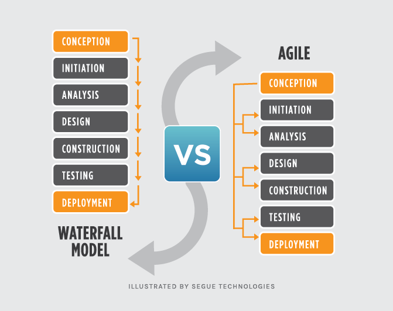
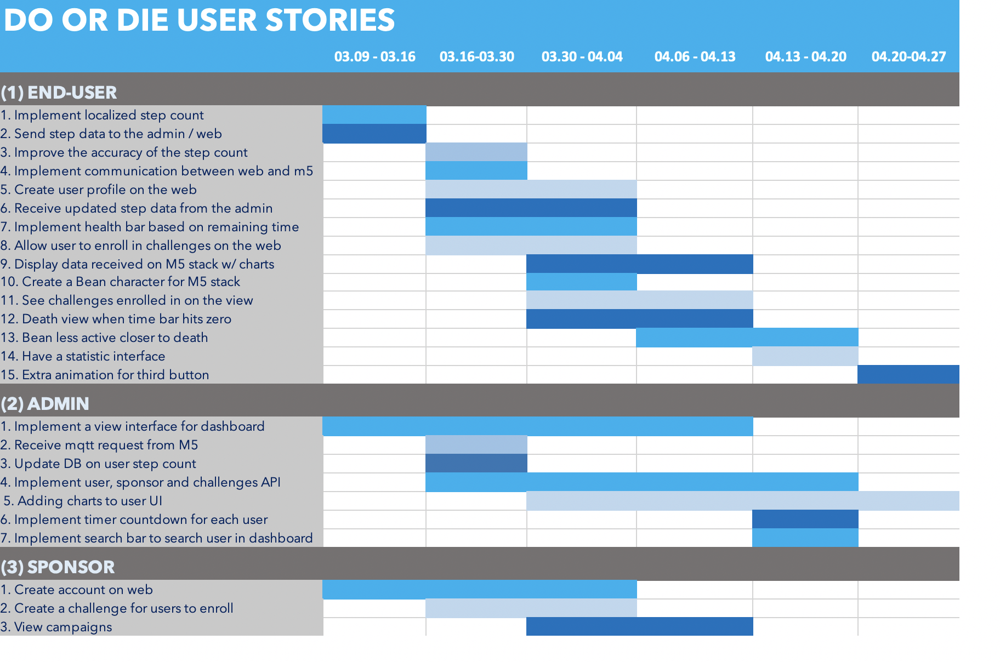

# System Implementation:

Now that we have highlighted how we decided on the [design of our system](SystemDesign.md), we will explain how the key aspects of our system were implemented. We will demonstrate how we used the architectural design that we created for our system to meet and implement each of our user stories, as well as how we maintained a minimum viable product by breaking our project into sprints. We will also evaluate the design of our system, and highlight the social and ethical implications of our product. 

## Table of Contents

- [**Software Development Strategy**](#software-development-strategy)
  - [Software Methodology](#software-methodology)
  - [Why Agile?](#why-agile)
  - [Agile In Practice](#agile-in-practice)
- [**Breakdown of project into sprints**](#breakdown-of-project-into-sprints)
  - [Sprint 1 : Define architecture & interactions (2.3-9.3)](#sprint-1--define-architecture--interactions-23-93)
  - [Sprint 2 : First prototype (9.3-16.3)](#sprint-2--first-prototype-93-163)
  - [NO SPRINT : Fight COVID-19 (16.3-30.3)](#no-sprint--fight-covid-19-163-303)
  - [Sprint 3 : Alpha version release (30.3-6.4)](#sprint-3--alpha-version-release-303-64)
  - [Sprint 4 : Resolving issues and enhancing features (6.4-13.4)](#sprint-4--resolving-issues-and-enhancing-features-64-134)
  - [Sprint 5 : Beta version release (13.4-20.4)](#sprint-5--beta-version-release-134-204)
  - [Sprint 6 : Version 1.0 release (20.3-27.4)](#sprint-6--version-10-release-203-274)
  - [Sprint 7 : Write-up (27.4-4.5)](#sprint-7--write-up-274-45)
- [**Details of design evaluation (techniques used & limitations)**](#details-of-design-evaluation)
  - [Initial Evaluation](#initial-evaluation)
  - [Evaluating the Quality Requirements](#evaluating-the-quality-requirements)
  - [User Testing and Evaluation](#user-testing-and-evaluation)
  - [Unit Testing](#unit-testing)
  - [System Integration](#system-integration)
  - [Reflection on Evaluation](#final-reflection-on-evaluation)
- [**Social and ethical implications**](#social-and-ethical-implications)
  - [Code of ethics](#code-of-ethics)
  - [Social benefits](#social-benefits)
  - [Data privacy and security](#data-privacy-and-security)
  - [Data usage](#data-usage)
  - [Social implications](#social-implications)
  
## Software Development Strategy
Prior to exploring how our team broke our project in to sprints, and how we evaluated our designs, it is first necessary to explain the development strategy that we used. We knew that in order to ensure a successful implementation of our product, we would need to adopt a software development strategy. This would ensure that we were able to successfully mitigate any risks, ensure smooth and continuous work-flow, and avoid any other disruptions to our development.

### Software Methodology
From the beginning of the development of our product, our team was aware that we had to meet certain goals within a certain timeframe, like any other software development project. The main goal and focus for Do or Die was to create a sufficient proof of concept by the beginning of May. With this in mind, our team had to decide how we would go about developing the software. Presently, the two most popular development models are [Waterfall](https://manifesto.co.uk/agile-vs-waterfall-comparing-project-management-methodologies/) and [Agile](https://learn.marsdd.com/article/product-development-using-agile-methodology-for-software-development/). The Waterfall model was initially published by [Winston Royce](http://www-scf.usc.edu/~csci201/lectures/Lecture11/royce1970.pdf), who himself admitted to its flaws and vulnerabilities when he first introduced it. The Waterfall philosophy has an incredibly structure approach to software development. Similar to a waterfall, each stage of the production cycle is sequential - flowing from one to the next. One negative of this, is that companies who do adopt this cycle spend a [considerable amount of time](http://www.mccormickpcs.com/images/Waterfall_vs_Agile_Methodology.pdf) in each stage of the cycle. 

On the other hand, the Agile development cycle is [inherently flexible and agile](http://www.mccormickpcs.com/images/Waterfall_vs_Agile_Methodology.pdf). Contrary to the Waterfall development method, the Agile methodology focuses on multiple iterative development schedules. Each of these schedules produce an improved product. The design of the system with an Agile methodology is not set in stone, and allows for last minute changes and adjustments based on user feedback and other external factors. Therefore, working software is delivered much quicker. This is due to the fact that, rather than having development focused on schedules and tasks, the implementation is focused into phases that are called "sprints". 

The above diagram, included from [Segue Technologies](https://www.seguetech.com/waterfall-vs-agile-methodology/), highlights the differences between the two development methodologies. 

### Why Agile?
Our team decided to adopt an Agile methodology for a number of reasons. Primarily due to the fact that it fit well for the requirements of our project. Our task was to create a proof of concept within a certain time frame. While at first glance it may seem like a Waterfall methodology would be a better fit, that is because we knew when our deadline was as well as what the goals were: our team knew that this was not the case. After the initial design of our system, we knew that it was constantly adapting and evolving, and our definition of Do or Die's proof of concept was therefore changing as well. Our team did not want to stick to a rigid idea of what our proof of concept would look like, and therefore knew that we wanted to adopt a software development methodology that would allow for this continuous change in circumstances and the appropriate benchmarks - which depended mainly on the tasks that were completed up until that point. Moreover, our team knew that we wanted to focus on the user and their requirements, as we wanted to create Do or Die to benefit the individual using it. Therefore, we also knew that we wanted to focus our implementation on user stories - which we mainly prioritised based on user feedback. Moreover, an Agile model allows for the improvement of previously developed features, which is not the case with the Waterfall method. By including analysis and design in each iteration, the Agile model allows for the development of the software to remain flexible. 

While Agile is an umbrella term, there are a number of different frameworks for implementing an Agile methodology, this includes methods like [Crystal Methodologies](https://www.toolsqa.com/agile/crystal-method/), [Feature Driven Development (FDD)](http://agilemodeling.com/essays/fdd.htm), and [Dynamic Software Development (DSDM)](https://www.solutionsiq.com/agile-glossary/dynamic-systems-development-method-dsdm/). However, Scrum remains the [most commonly used](https://ieeexplore.ieee.org/stamp/stamp.jsp?arnumber=8229928&casa_token=ZpJFJO8t7hkAAAAA:w125nNXY-UHh4jvLH1AgniCpHj1WJszYysVMXQ3kOAKKTzWj6yXE_T7k1jNLjs7LqONMPUPA&tag=1). The Scrum model allows for a more customised way of working, as well as having a variety of requirements. Similar to the Scrum model, is the [Kanban method](https://www.cmswire.com/information-management/agile-vs-scrum-vs-kanban-weighing-the-differences/) which also includes a physical board. The Kanban method, however, focuses on teh prioritising the items in the backlog and does not have a strict timeframe for when items need to be completed. However, the scrum model is more prescribed but implements the workflow using sprints. Therefore, our team decided to use a combination of both methods - that is the use of sprints from the Scrum model, while we knew that we wanted to visualize our workflow with the Kanban board feature offered on Github. In the next section, we will explain how our group chose to implement the Agile methodology for the implementation of our product. 

### Agile In Practice
At the beginning of each sprint we decided the features that we would implement during that sprint, the tests that we expected each subsystem to pass, and the user stories that we expected to be satisfied by the implementation of those features. During each iteration we defined the requirements based on the backlog from previous sprints, and test user feedback. We then designed the software based on the requirements that we had established as a group, before coming back together during our weekly sprint review to undertake quality assurance testing and integration testing. We then integrated our product by merging all changes to the master branch of our Github. Our Github processes will be explained in further detail when we [evaluate our project](ProjectEvaluation.md). Finally, we evaluated our previous version before defining the requirements for the next sprint. One of the key aspects of Agile development is active user involvement, which affected the way that we evaluated our designs. Our [design evaluation](#details-of-design-evaluation) methods will be considered and evaluated below.

The above diagram, included from this [website](https://hackernoon.com/a-case-study-type-insight-into-agile-methodologies-for-software-development-cd5932c6), demonstrates the development cycle that our team followed during the creation of our product. 

## Breakdown of project into sprints
We organised our work as a series of one-week sprints from early March to mid-May. While we knew from the beginning that we would have weekly sprints, the main focus of each sprint was typically dictated by what was left in the backlog from the week before. Anything remaining in the backlog, was therefore, prioritised for the following sprint. We reviewed our product at the end of each week, using methods that will be described [below](#details-of-design-evaluation). Our main goal at the end of each sprint was to constantly produce a working product. The requirements for that sprint, in line with the Agile method, were dictated at the beginning and did not change during the week. The list of requirements acted to outline our tests, and ensure that our systems were able to be integrated successfully at the end of each sprint. As this was a rapid timeline to produce a working prototype, we knew that we wanted to aim for a 'release' of our product at the end of each sprint after the 30th of March. After defining our architecture in the first sprint, we aimed to see how much work we could achieve in terms of implementing the system in the second sprint. This then helped us to ensure we set realistic requirements and goals for each successive sprint. 

We met in person or talk as a group over Google hangouts each Monday at 3pm for a sprint review/retrospective. The work over from the last week was presented and discussed, with completed items marked as "done". The to-does for the coming week/sprint as well as the backlog for later sprints was agreed upon. The coding pairs for the different substreams had bilateral "stand-ups" to check on how the work is progressing and problem-solve. Also, we discussed interactions between subsystems as needed during the week. In the following week we listed all the items for the week as “Backlog" or “Done”. The backlog was moved to later sprints, with only items remaining in the done column in the end. 

As one of the key foundations of Agile software development is to have self-organising teams, we knew that it was important to collectively focus on the most important user stories to be implemented during each sprint. We were confident in our capabilities to successfully maintain a minimum viable product during each week's sprint. In order to keep this clear, we created a Gantt chart to be used between each of the teams working on the different subsystems. The Gantt chart depicts each of the programming tasks that had to be implemented (subsystem-dependent) in order to implement each user story. 

This was used in conjunction with our project's [Kanban Board](https://github.com/Team-Jag/Do-or-die-fitness-tracker/projects/1). We used the Kanban board to keep it clear which requirements needed to be done, what people were currently working on, and what was completed. We also added a backlog column for features that we pushed for later iterations. Both of these features were useful to keep our work user focused, while ensuring cohesion between each subsystem. 

In the follow section we will break down our goals of each sprint, list what was completed per subsystem, the key user stories implemented, and what remained in our Backlog in terms of WIP. We will also refer back to our fictional user [Mario](https://github.com/Team-Jag/Do-or-die-fitness-tracker#the-user) during each sprint to show what has changed, and how the end-user, sponsor, and admin can now interact with our product.

### Sprint 1 : Define Architecture & Interactions (2.3-9.3) 
The goal of this sprint was to agree upon our architecture and the interactions so that the workstream would know how to design their sub-systems. During this sprint we decided on how we would move forward in developing our product. This included the creation of our Github repository, and beginning to familiarise ourselves with how we would use different features including the Kanban boards, Pull Requests and Issues. This also included the ideation stage, and definition of the communication protocol between devices so that different teams could begin implementation autonomously. Additionally, we decided on goals to prioritise in order to arrive at a minimum viable product by the next sprint.

**Key meeting points:**
* Defined and agreed on overall infrastructure (shared on Slack).
* Defined minimum viable product (MVP) with functions/classes/variables.
* Defined interactions between subsystems including a first iteration of the request types and their JSON syntax.
* Establish Github protocol (including how we would use the project board, as well as pull request and issue protocol).
* Design a basic UI interface mockup for admin user story.

**Reflections**
In this sprint the most important aspect was to finalise our design and evaluate how effective it was in allowing us to implement the product most conforming to our use cases. As we were still in the design stage, this sprint facilitated many changes, such as the basic UI layout and the communication protocol between devices. Defining the overall structure was crucial for future progress, which was why we prioritised these goals to make sure our progress was fast during further sprints as every member of the team was sure what features needed to be implemented next. We also defined our minimum viable product (MVP) for our next sprint; to make sure we had enough features for a product that satisfied minimum customer requirements as defined through our user stories during the design stage. In defining our goals clearly for the next sprint, we would have a product which could be evaluated by users based on feedback which could further inform our implementation decisions for future sprints. During this stage we experienced several issues in terms of deciding on what we wanted to work on first. Eventually, for our product we decided to prioritise the end-user story, the core of our product experience as this will be the use case most commonly interacted with. This involved having a fully functioning pedometer able to count steps by the end of the next sprint.

**Backlog:**
* Implementation of communication protocol.

### Sprint 2 : First Prototype (9.3-16.3)
The most important of our user stories is that of the end-user, so our first sprint should focus on delivering a fitness tracking feature onto the M5Stack in the form of a simple step counter. 
To allow the user to count and keep track of their steps between sessions, we need to make the step data persistent, so we also need to develop a basic first version of our desktop server. Furthermore, we wanted to create a first view for out end-users and sponsors. Therefore, the goal of this sprint was to create a basic proof of concept to demonstrate the key feature of incrementing step count, a vital user requirement of the end-user story.

#### New features implemented: 
* M5Stack able to count steps (pedometer functionality).
* M5Stack able to send a notification to Desktop server for each new step.
* Desktop able to process the notification, increment the total steps and ensure data persisted, and sends the updated user profile back to the M5.
* M5 able to process message from processing and display total steps.
* Created web design and mock-up pages.
* Decided on a UI interface for admin user story, and made a mock-up Processing interface using dummy Control-P5 elements.

<table>
<tr>
  <th>Stakeholders</th>
  <th>Updated Use Case</th>
</tr>
<tr>
  <td>
    <a href="https://github.com/Team-Jag/Do-or-die-fitness-tracker/blob/develop/Portfolio/SystemDesign.md#end-user">
       Mario (End-User)</a></td>
  <td>I am now able to use my M5Stack to count my steps, and see the steps updated each time on my Stack, it's great to be able to measure my progress but it doesn't reliably update the step counter as I walk around. The interface looks quite plain though, I wish there was more to look at on the Stack. </td>
</tr>
</table>

#### Key implementation issues found: ####
<table>
<tr>
  <th>Technology</th>
  <th>User Story</th>
  <th>Issues Encountered</th>
  <th>Issue Handling</th>
</tr>
<tr>
  <td>Desktop</td>
  <td>End-user is able to use the M5Stack as a pedometer and view total step count.</td>
  <td>Initial design of step_count was stored as a string, which was redundant as this makes it more difficult to increment step count.</td>
  <td>Changed data type stored in step_count into an integer.</td>
</tr>
<tr>
  <td>M5Stack</td>
  <td>End-user is able to use the M5Stack as a pedometer and view total step count.</td>
  <td>We had some issues with merging the Pedometer external code with our MQTT communication code, rather than simply copy-pasting the Pedometer code into our main loop(), as that would make our code very hard to read and debug.</td>
  <td>We stored the pedometer code in a separate Class and made it so it simply changes a flag in the main loop() when a step is taken.</td>
</tr>
</table>

#### Reflections ####
In this first "coding" sprint we were able to build a first mock-up view of product. In convinced us how powerful the agile methodology is, in that it allows you to produce working code and produce a tangible outcome quickly. Also, we realized how important user testing and feedback is: things that were obvious to the coder/designer such as how to navigate a website or the M5 were not as intuitive to a new user as one would think.
Most importantly we realized that it will be highly important to prioritize and stick to the tests defined by the MVP and not get side-tracked by additional features in order to deliver our product in time.

**Backlog:**
* Improve the accuracy of the step count.

### NO SPRINT : Fight COVID-19 (16.3-30.3) 
Due to COVID-19, the team agreed to push all work to the backlog and not meet until after the deadline. As our team followed an Agile method for development, each of the sub-teams worked to ensure that we had completed what we had previously agreed to before continuing meetings the following Monday. This also allowed for us to restructure the goals of our project and ensure that the way we had prioritised user stories was sufficient for ensuring our MVP. 

### Sprint 3 : [Alpha Version](https://github.com/Team-Jag/Do-or-die-fitness-tracker/pull/7) Release (30.3-6.4)

The goal of this sprint was to release the Alpha version of our product, by pushing our MVP to the master branch. This involved ensuring all subsystems could receive, process, and send the intended MQTT commands. During this sprint, our main goal was to ensure that all three subsystems could interact with each other, and were accurately conforming to the [shared contract](https://github.com/Team-Jag/Do-or-die-fitness-tracker/blob/develop/Documentation/Mqtt_request_types.txt). 
Furthermore we wanted to integrate the other user-stories (sponsor & admin): Delivering a web interface where a sponsor can sign-up and create challenges for the end-user and an interface for our Desktop server from where the Admin can monitor the performance of the product.

#### New features implemented:
* Improved the view for the M5Stack (including the above additions of the Bean sprite and the health bar).
* Desktop database API able to add challenge to user, sends challenges enrolled by user, add new user sent from web, and add new challenges.
* The end-user is now able to create an account and enrol in challenges on our web interface.
* We added a Bean sprite on the M5Stack's interface, without animation, along with a health bar representing its remaining life. This should elicit an emotional response in the user leading to an increase in motivation.
* The Admin can now visualize product performance (dummy) data in the Desktop app.

<table>
<tr>
  <th>Stakeholders</th>
  <th>Updated Use Case</th>
</tr>
<tr>
  <td>
    <a href="https://github.com/Team-Jag/Do-or-die-fitness-tracker/blob/develop/Portfolio/SystemDesign.md#end-user">
       Mario (End-User)</a></td>
  <td>I am more attached to my M5Stack as I can see my Bean avatar, and feel much more attached to it. I am also excited, as it feels like I can do more with my purchase! I can log in to the website, and enrol in challenges for the first time. This motivates me even more to get active. I'm glad that the interface on the Stack has improved but it remains static, so I'd prefer the Bean avatar to be more interactive and animated when I use the Stack. </td>
</tr>
<tr>
    <td>
    <a href="https://github.com/Team-Jag/Do-or-die-fitness-tracker/blob/develop/Portfolio/SystemDesign.md#sponsor">
       Jimmy (Sponsor)</a></td>
  <td>I can create an account on the web.</td>
</tr>
<tr>
  <td>
   <a href="https://github.com/Team-Jag/Do-or-die-fitness-tracker/blob/develop/Portfolio/SystemDesign.md#sponsor"> 
      Amita (Admin)</a></td>
  <td>I can now see product performance in the Desktop app, including general data on the userbase.</td>
</tr>
</table>

#### Key implementation issues found: ####
<table>
<tr>
  <th>Technology</th>
  <th>User Story</th>
  <th>Issues Encountered</th>
  <th>Issue Handling</th>
</tr>
<tr>
  <td>Desktop</td>
  <td>User is able view and select challenges, sponsor can add new challenges, user is also able to create new profile.</td>
  <td>As data sent from the web to create new profile did not add default values for other required data (e.g. remaining_sec), the system will crash if a request for this faulty data was fetched and attempted to be sent.</td>
  <td>As the issue encountered was due to the lack of testing on how the API handles null JSON objects, future implementations should include relevant testing. However, due to limited time for the project, this was not carried out and the extent of the implementation of a working system was only for the sake of the demo.</td>
</tr>
<tr>
  <td>Web</td>
  <td>Built functioning prototype that allows for navigation between pages and send & receive dummy data.</td>
  <td>Data retention turned out to be very challenging as the react state and all JS variables are reset when loading a now page. Also, passing arguments between react components, is tricky as the exact path the user takes is unknown, and the variables passed might not have been initialized yet. </td>
  <td> As a solution redirects instead of URL links were used for navigation (this way the react app does not reload from scratch) and the user_name variable was made global so that it was accessible for all classes and did not needed to passed through all the components.</td>
</tr>
<tr>
  <td>M5Stack</td>
  <td>User is able to view the Bean's remaining 'health'.</td>
  <td>At first we attempted to build our own HealthBar class using only the basic shapes library in arduino.</td>
  <td>Eventually though we were able to find a ProgressBar() method which was part of the default library. So we made a simple wrapper class Bar.h which uses the ProgressBar() method to produce the Bean's health bar (and can be used for other tasks in the coming sprints). The Bar.h class also handles other minor things such as the bar's refresh rate (to reduce flickering) and places a border around the bar for clarity. </td>
</tr>
</table>

#### Reflections ####
As described above we all faced challenging issues as we extended the functionality of our sub-systems. This was when the value of coding in pairs became most evident to us: the other person could not only review and challenge your code, but with two people familiar with the details of a system we were able to find solutions significantly quicker.
The release of the alpha version also sharpened our view on what we still had to do for our beta release: it was less about extending the product and adding many more features but more on getting the basics right: improving the reliability and delivering an intuitive visualization (again the user tests showed that the best functionality is worth little without an intuitive design/handling).

**Backlog:**
* All subsystems provide a basic version of the agreed visualization.

### Sprint 4 : Resolving Issues and Enhancing Features (6.4-13.4) 
The only user-story left to complete was that of the sponsor, so in this sprint our Web team focused on developing the key functionality of creating custom challenges and sending them to the desktop server to be made available to the end-user.
The first iteration of our other user-stories has been delivered, so for our other teams this sprint focused mainly on improving the quality of the user-stories we had already delivered, rather than layering new functionality on top of subpar unpolished foundations.
Therefore, for the M5Stack and the Processing App, the goal of this sprint was to improving design and visuals as well as extending our interfaces.

#### New Features Implemented:
* Basic animations for Bean sprite implemented on M5Stack.
* User can see the challenges that they are enrolled in on M5 stack (dummy data).
* User can see basic statistics about their step count on M5 stack (dummy data).
* User can see their full information and challenges if they are logged in on our website (dummy data).
* Sponsor can create new customised challenges for all users on our website.
* Admin can see charts of total users, challenges, sponsors on our Desktop app.
* Admin dashboard pulls data from backend database API.
* All subsystems able to receive, process and send the intended MQTT commands.
* All subsystems provide a basic version of the agreed visualization.
* Agreed on how user death would work across subsystems.

<table>
<tr>
  <th>Stakeholders</th>
  <th>Updated Use Case</th>
</tr>
<tr>
   <td>
    <a href="https://github.com/Team-Jag/Do-or-die-fitness-tracker/blob/develop/Portfolio/SystemDesign.md#end-user">
       Mario (End-User)</a></td>
  <td>The Bean avatar on my M5Stack is even better and makes me feel more attached to it, as it now animates by jumping across the screen. Unfortunately the progress I make towards the challenges I enrolled in on the website don't update, so I'd like that to be fixed so I can receive the rewards from all the challenges I've completed. </td>
</tr>
<tr>
  <td>
    <a href="https://github.com/Team-Jag/Do-or-die-fitness-tracker/blob/develop/Portfolio/SystemDesign.md#sponsor">
       Jimmy (Sponsor)</a></td>
  <td>I am now able to log on to the website and create new challenges for the users.</td>
</tr>
<tr>
  <td>
   <a href="https://github.com/Team-Jag/Do-or-die-fitness-tracker/blob/develop/Portfolio/SystemDesign.md#sponsor"> 
      Amita (Admin)</a></td>
  <td>I can now see all the users, available challenges, and the sponsors that have signed up to use our product in the Desktop app. I can also see updated data from the users.</td>
</tr>
</table>

#### Key implementation issues found: ####
<table>
<tr>
  <th>Technology</th>
  <th>User Story</th>
  <th>Issues Encountered</th>
  <th>Issue Handling</th>
</tr>
<tr>
  <td>Desktop</td>
  <td>Admin now has access to real data analytics pulled from the database, and can track flat totals of sponsors, users and challenges.</td>
  <td></td>
</tr>
<tr>
  <td>Web</td>
  <td>End-User</td>
  <td>The react app would crash if it received null values (e.g. for new user). </td>
  <td>The parsing and redirecting had to be redefined (through the use of flags e.g. account exists), the exact server response was to be agreed on with the processing team.</td>
</tr>
<tr>
  <td>M5Stack</td>
  <td>End-User is able to visualize their data on the M5Stack</td>
  <td>When attempting to replace Challenges and Statistics dummy data on the M5Stack with appropriate requests on the MQTT Topic, we found that the M5Stack ignored all messages on the MQTT Topic that were above a certain length.</td>
  <td>We tried to fix this issue by reducing the length of the JSON packages however this proved unfeasible since the limit of character after which messages would be ignored was way too low (113).
  We looked for other solutions online unsuccessfully, therefore we weren't able to complete this feature during this sprint and had to stick with the dummy data.</td>
</tr>
</table>

**Reflections**
Since our communication mechanisms had already been tested and proven to work in our previous sprints, this sprint promised to be one of the lower workloads sprints, at least for our M5Stack and Desktop teams.
However the MQTT message length issue knocked all our hopes down, and made the life of our M5Stack team very hard. However thanks to our Agile development strategy, we were able to quickly come up with a contingency plan to rework our shared contract in the eventuality that our M5Stack team weren't able to rapidly find a solution to that problem. 

**Backlog:**
* MQTT message length issue with M5 Stack.
* Real data for statistics and challenges on M5 stack.
* All subsystems to handle user death. 

### Sprint 5 : [Beta Version](https://github.com/Team-Jag/Do-or-die-fitness-tracker/pull/44) Release (13.4-20.4) 

Previously, an issue was found while implementing the communication protocols on the M5Stack in which its consequences would be highly disruptive, since it meant that we had to re-design the protocol between desktop and M5. However, a solution was found before this sprint was carried out. As we have established our MVP in previous sprints, we determined as a group that we were nearly ready to release the Beta version of our product (which would be pushed to the master branch). We decided that the following user stories which still needed improvements before official release were mainly focused on user experience such as: **(1)** animation of the Bean sprite reflecting health levels (in which only the desktop back-end will perform calculations of time left for each user) and displaying its death on the M5Stack, **(2)** being able to view interactive and real-time challenge data on the Web, and lastly, **(3)** the admin being able to track total users enrolled and proportion of players currently alive.

#### New features implemented:
* Replaced dummy data with appropriate server requests on M5 stack for challenges.
* Life timer countdowns for all users in desktop user API.
* Database automatically updated when user reaches any goal of challenges enrolled and adds rewards.
* Improved sprite animation: frequency and height of bounces linearly scales with time left.
* M5 stack handles user death by printing a death screen once, and then executing empty loops until shut down.

<table>
<tr>
  <th>Stakeholders</th>
  <th>Updated Use Case</th>
</tr>
<tr>
  <td><a href="https://github.com/Team-Jag/Do-or-die-fitness-tracker#the-user">Mario (End-User)</a></td>
  <td>I can now view my challenges on my M5Stack, and no longer just have to log on to the website to do that. I also get the actual rewards for each challenge, and am finally feeling more motivated to meet these goals! I also know when my Bean is closer to death, because it starts to bounce less and less. When I don't reach my goals and let my life timer run out however, the screen updates to a death screen to let me know that my Bean has died. The step counter still isn't perfect and I can't see how I've performed in the past so I don't know if I have improved overall or not with my Bean, it would be great if I could see some more of my own performance data somewhere on the device. </td>
</tr>
</table>

#### Key implementation issues found: ####
<table>
<tr>
  <th>Technology</th>
  <th>User Story</th>
  <th>Issues Encountered</th>
  <th>Issue Handling</th>
</tr>
<tr>
  <td>Desktop</td>
  <td>User is able to see life timer countdown and finishing challenges will add rewards to health.</td>
  <td>The timer counts down each user 'remaining_sec' every second only when the system is running. As this is only a prototype, we decided not to implement a 'real' timer which would countdown even when the system is down. It was implemented this way just for convenience for the demo, so dummy data does not have to be initialised new every time.</td>
  <td>For future implementations, the design of user data would need to be reassessed as a timestamp for when data was accessed/updated is required. This would allow the system to calculate the time left based on that stamp, instead of requiring the system to update the time remaining for each user every second.</td>
</tr>
<tr>
  <td>Web</td>
  <td>End-User</td>
  <td>User should be able to select his own profile picture. If we wanted the users to have complete control over the choice of profile picture, that would mean users uploading links to the images from elsewhere on the internet, but we have no database to physically store images uploaded from their local systems. However the problem with this is that viruses can be embedded into images online and so a malicious person could choose to harm the website/system using this method.</td>
  <td>As a result, we decided to have the users pick from a small selection of images stored already in the source files.</td>
</tr>
<tr>
  <td>M5Stack</td>
  <td>End-User is able to visualize their data on the M5Stack</td>
  <td>The M5Stack's PubSub library completely ignores messages over a certain character length.</td>
  <td>Thankfully, we realized that this wasn't exactly a bug, but a feature of the library which allows the M5Stack to ignore messages that are too long and would cause overflow problems. The maximum limit of a messages however can easily be changed by #defining the threshold before importing the library.</td>
</tr>
</table>

#### Reflections ####
During this sprint meeting, we only briefly attempted to integrate our systems, web and desktop, to view that the timer was counting down properly. In hindsight, we did not extensively test all possible communication protocols, and also did not resolve whether the web was initialising default values within other fields when creating a new user profile. The latter was quickly realised before the next sprint was held and decided that the desktop will handle data initialisation instead. We also realised the importance of establishing a constantly updated communication protocol, as during integration, it was clear that changes of data types from String to Int was not implemented yet in the Web when creating new challenges, which was in turn rejected by the database API. As a result, we went through the [MQTT_request_types.txt](/Documentation/Mqtt_request_types.txt) together to clarify potential misunderstandings. We then decided for the next sprint, an interaction feature was needed on the M5Stack, statistics dummy data physically stored on the M5Stack should be fetched from the database instead, and a sponsor API should be implemented to the database API to fetch sponsor data.

### Sprint 6 : [Version 1.0](https://github.com/Team-Jag/Do-or-die-fitness-tracker/pull/115) Release (20.3-27.4)
Since the majority of user features had already been implemented we decided to focus on the sponsor and admin views, as well as synchronicity between all three systems, for this sprint. To allow the admins to see the user statistics reflected on the statistic view so that they can better monitor user activity, a search bar feature was implemented to find the user data from the local files. In order for the admins to track the popularity of the app, additional charts were also created over differing time periods (daily, weekly, monthly) in the desktop application. The purpose of a sponsor account is to create challenges for players and as such, the sponsors on the web upon account creation (where the end-user can now decide if they are a user or a sponsor) get redirected to the challenge creation page instead of the profile page.

The goal of this sprint was to clean up and refactor our code, and implement any final features before releasing Version 1.0 of our product.

#### New features implemented:
* Replaced dummy data with appropriate server requests on M5 stack for statistics.
* Added dummy statistics data (i.e. weekly_record of step count) into users.json.
* Implemented sponsor API in desktop and push new challenge from web will add challenge to sponsor data.
* Desktop automatically enrols new user to a maximum of 10 challenges, and initialises default values of health and step count.

<table>
<tr>
  <th>Stakeholders</th>
  <th>Updated Use Case</th>
</tr>
<tr>
  <td><a href="https://github.com/Team-Jag/Do-or-die-fitness-tracker#the-user">Mario (End-User)</a></td>
  <td>I can now see my statistics accurately on my M5Stack, which means that I don't have to log on to the web and no longer just see my total step count. I can see weekly and monthly averages in my statistics tab. My M5Stack is now a great step tracker, letting me know all totals, has an accurate Bean with great animation, and I can go through each of the challenges I enrolled in on the web. The only thing I wish could be improved is the screen on the Stack flickers as it animates, other than that this tracker is amazing. </td>
</tr>
</table>

#### Key implementation issues found: ####
<table>
<tr>
  <th>Technology</th>
  <th>User Story</th>
  <th>Issues Encountered</th>
  <th>Issue Handling</th>
</tr>
<tr>
  <td>Desktop</td>
  <td>New end-user will be automatically enrolled to a maximum of 10 available challenges.</td>
  <td>An issue was discovered in Sprint 4 where the M5Stack could not receive MQTT payloads when JSONArray challenge_id was sent with the user data.</td>
  <td>A limit of 10 challenges for each user was established to ensure data communication from the desktop to the M5Stack will be received. However, no extensive testing (including attempts in integration to select more than 10 challenges from the web) has been done to ensure correct implementation</td>
</tr>
<tr>
  <td></td>
  <td>The admin can now access and view all user, sponsor, and challenges information in real-time.</td>
  <td>During our attempts at integrating all systems for our video demo, the desktop app frequently crashed when large amounts of requests were received from the web.</td>
  <td>As the crash only happens when trying to integrate real-time data communication between systems, we rationalised the errors to be coming from Processing not being able to handle large amounts of synchronous request types. However, the errors were hard to pin-point when the system is running alone as it does not crash anymore, hence this issue still remains open.</td>
</tr>
  <tr>
  <td>Web</td>
  <td>Sponsors</td>
  <td>Redirect logic for user and sponsor needed to be changed and refactored as multiple of same request being pushed to the MQTT broker by the scripts</td>
  <td>Changed pull request type to "pull web profile" to determine user existence based on entries in the JSON, and refactored code inside redirect handler to only call push query once to broker</td>

</tr>
<tr>
  <td>M5Stack</td>
  <td>End-user is emotionally invested in the Bean's wellness due to its pet-like features and animations.</td>
  <td>Due to the M5Stack's slow screen drawing library, the Bean's animations are noticeably flickery.</td>
  <td>We explored Arduino's examples where fast animation was implemented and we realized that those examples edited the frames a byte at a time. 
  Due to our time constraints we decided changing our draw() methods to be byte-by-byte was way out of our realistic scope, so instead we applied simpler improvements: firstly we made it so only the sections where movement had taken place were re-drawn, by storing the old position of the Bean after each move() call. That provided a noticeable reduction in flickering however we weren't happy with it yet so we also decided to control the refresh rate by including timers to all our draw() methods. 
  Even though there is still a slight flicker in our animation, we decided that for our prototype such a small imperfection was acceptable.</td>
</tr>
</table>

#### Reflections ####
As seen in the table above, all systems faced issues in implementation of key user stories. By utilizing pair programming as outlined in agile development, we were able to resolve these issues far quicker than by leaving any given individual alone on the issue, furthermore the agile method allowed the frequent release of test driven builds centred around quality over anything else, which for this sprint was the most important aspect.

The release of the 1.0 version signified the end of creating features to instead focus on polishing existing features while ironing out the final bugs and warnings remaining in certain edge use cases. To deliver an end-user ready product not only with the basics created during alpha and beta phase, but also the embellishments and add-ons to each system (Desktop, M5, Web) since beta for the final delivery. Please see Sprint 7 for the full list of items that remain in the backlog after the development of our proof of concept. 

### Sprint 7 : Write-Up (27.4-4.5) 
On our last leg of the deployment in the Agile development cycle, the goal of this final sprint will be to finish the documentation, as well as address any issues that arise from the release of Version 1.0 for quality assurance, and implement any final features. As our system has integrated adequately for the demo in the previous sprint, and the Web and Desktop teams are content with the outcome, only the M5Stack added an additional interaction feature. In order to undertake the writing of our portfolio, our group chose to create a second [Kanban board](https://github.com/Team-Jag/Do-or-die-fitness-tracker/projects/2) focused solely on documentation, to continue using the same Agile working methods that we used to develop our software. Furthermore, to display how our systems would work together and how they would be used, we shot a short demo video of our product. Finally, our initial features that made up our [product description](https://github.com/Team-Jag/Do-or-die-fitness-tracker#the-product) were kept in the backlog, which can be viewed on our [Kanban Board](https://github.com/Team-Jag/Do-or-die-fitness-tracker/projects/1), as well as in our [open issues](https://github.com/Team-Jag/Do-or-die-fitness-tracker/issues). These features are to be implemented in future sprints before further release to the public. 

**Reflections:** 

Final reflections can be viewed in the [project evaluation](https://github.com/Team-Jag/Do-or-die-fitness-tracker/blob/develop/Portfolio/ProjectEvaluation.md#general-reflection-of-success) section.

**Backlog:**
* Improve animation on the M5Stack, which includes removing the flicker. 
* Allow the end-user to update their profile picture. 
* Retain the user-name of the end-user in the react app when the browser is refreshed. 
* Continue the timer countdown even when the system goes down. 
* Further extensive null testing in the desktop. 
* Add extra animation to the M5Stack with the interact button. 
* Remove the processing warnings. 

## Details of design evaluation

A key aspect of our software development cycle came from our weekly software and design evaluation during our meetings. Each of our techniques for evaluating our design will be considered in turn in the following section, as well as their limitations. Going hand in hand with our software design cycle and during each sprint, we also found that we had - in some ways - a design evaluation cycle. At the beginning of each sprint, we would have a preliminary design that we expected we would develop during that sprint. This included the user stories that we wanted to implement, and how we would do this. During the sprint we would implement these, as highlighted above, however within our design cycle we would then have a number of forms of evaluation at the end of our sprint. This stage of our design cycle allowed us to shape and form our requirements for the next sprint, as well as reprioritize the user stories where necessary. During the design evaluation phase, we would utilise a number of methods and techniques for evaluation. The main methods for our design evaluation involved some form of testing to ensure that our design was working as expected. 

### Initial Evaluation
Initially for the design idea of the base product we wanted to produce, the minimum viable product, we used a design evaluation matrix with scoring from 0 to 5 for each small feature in order to determine its value based on the strategic outcomes. The metrics used to determine the scores were: the idea's potential impact, the timeline to implement said idea, and difficulty to learn the technologies required to implement. The features shown in the first sprint above were these initial features decided by the evaluation matrix.

Potential limitations of using the evaluation matrix are the chance of concentrating on features of too little significance, instead of concentrating on user centric features we instead focused on what was achievable in a given sprint timeframe. The scores assigned to each metric are also entirely subjective, so a more complex analysis would have been more appropriate to critically determine the value of a feature. However, our team found as we moved further in to evaluating our design during each sprint, that this evaluation method was not as useful as we had first thought. 

### Evaluating the Quality Requirements
We knew when designing our system initially that we wanted to focus largely on the non-functional requirements. These included the security of our system, the maintainability, the ease of use, and the reliability of our system as a whole. This relied in large part on testing our system in an integrated manner, which will be explored further below. However, we will first consider each of these "non-functional" requirements and how evaluating them during our sprints changed the design of our system. 

#### Security
From the [design stage](https://github.com/Team-Jag/Do-or-die-fitness-tracker/blob/develop/Portfolio/SystemDesign.md) to the implementation stage, security was considered to be an integral part of the system as a whole. Implementing the database class as abstract and private allowed for request validation before the persistent files were accessed, which separates the physical data from other devices. This lowers the chance of injection attacks, and consequently having unvalidated data reflected back to the user (cross-site scripting on the web side, arbitrary code injection on the M5 side). Additionally, this separatation protects the database files themselves from being malformed and causing a Denial of Service attack or non-malicious issues stemming from malformed requests.

Additionally, we took great care in implementing the M5 device as stateless. While lacking authentication, even if the device was stolen or lost, user information can be removed as everything is stored on the back-end of the processing app.

#### Maintainability
While our team was a relatively small team, and could easily maintain our product if necessary, we wanted to develop it in a way that allowed it to be maintained by a larger team. This meant developing each part of our system to conform with our shared contract, to allow us to meet new requirements. Moreover, make the code in each part of our system as clear as possible to allow for quick changes. 

Code was implemented with modularity in mind, which allowed each device team to update their subsystem without breaking the entire codebase. 

#### Ease of Use
At each stage of the implementation process, we aimed to conform to user specifications outlined in the [design documentation](https://github.com/Team-Jag/Do-or-die-fitness-tracker/blob/develop/Portfolio/SystemDesign.md). However in doing so, we also aimed to make the features of each device as easily accessible to the relevant user story as possible.

The end-user first follows easily laid out instructions on the Web page to create an account. The end-user turns on the M5 stack, connects it to the internet, then has no further setup steps required. The device is ready to be used and begin counting steps and accepting challenges.

For the sponsor use case, this is very similar except the only device they interact with is the Web. The sponsor creates an account, logs in, and publishes challenges. 

Implementing the admin use case, we aimed to maximise the amount of useful information on the screen, without letting the admin become overwhelmed. Charts are clearly labelled according to what metric they belong to, and search bar is clear and easy to find. 

### User Testing and Evaluation
The one key concept that our team kept coming back to was that our product was made for someone, and thus our main focus was on the end-user when designing and implementing our product. If the end-user was not happy, or not able to use our product, then there would be no need for the admin or the sponsor. While our user testing was affected by our move to remote working, prior to this we used this method to evaluate our design extensively during each sprint. We had our peers and friends use different aspects of our product, and comment on what they liked and did not like. Moreover, we watched how they interacted with the different parts of our system in order to see what needed to potentially be changed, and what could be made easier so that the user did not feel like accessing different parts of our system were a chore. 

This method for evaluating our design was incredibly effective, we were able to simplify certain parts of our architecture such as what we expected from the M5Stack. Once we realized that most users would be content to first have a simple step tracker with their Bean animated, we put our focus on this user story rather than trying to implement too much at once. This evaluation technique allowed us to step back and help us to realize what was most important from our design. 

Moreover, it ensured that we prioritised what needed to change. One example of this was the decision to change the log in feature on the web. While designing our product we decided that you would need to log in with a username as well as an email, however we quickly realized that this was cumbersome for the user and it would make more sense for them to just log in with their username. This was due to user evaluation of our design. 

### Unit Testing
At every stage of the implementation process we aimed to have a set of tests for each component in order to verify they worked correctly. These were decided based on the user stories that we had chosen to implement during that sprint, and catered for each of the key subsystems. In particular, the Processing backend up utilized a testing class which compared dummy JSON payloads against existing files in the database to ensure the correct information was pulled. Additionally, tests were added to show the app could handle edge cases. This included purposefully malformed requests (to make sure the app did not crash), and insertion/deletion of null objects, in order to be certain the database API could handle any type of input. The front-end of the desktop app relied on visual user testing due to its dependency on the draw() function, but crafted JSON objects were manually added to the database storage and this was compared against the totals drawn to make sure they were accurate. 

Due to the physical nature of the M5 device, the gyroscope had to be tested by physically moving it and comparing the expected step increments with what resolved through the step function.

### System Integration 
As the success of our product relied on our three key subsystems working together, it was necessary to perform extensive integration testing at the end of each sprint. This would take place during our weekly scrum. During this aspect of evaluating our design, we would go through our shared contract to ensure that all systems preformed as expected when using the shared contract. During earlier sprints, it was clear that there was unnecessary information included in certain request types and that these would have to be adjusted. The success of this method of evaluation, however, relied on ensuring that each unit was thoroughly tested individually. Once we were certain of this, we tested them together. 

Due to the fact that we implemented a shared contract between all subsystems, it was easy to test them together. We chose to take an incremental approach to integrating our subsystems during each sprint. By doing it in this manner, we were able to first test that the web and desktop, for example, integrated as expected and both responded correctly to the same request types. Once we certain of this, we were able to test the M5Stack with the desktop before then testing all subsystems as a single unit. As the web and M5Stack did not directly interact, this allowed for ease of testing. 

#### Test Scenarios
After integrating our system for the first time, we realized that we needed a more effective way of ensuring that our systems had integrated correctly. Thus, we decided to focus on testing the user stories that we had outlined at the beginning of the sprint during each scrum. These user stories dictated our requirements for each sprint, therefore ensuring that each team was on the same page. Doing this allowed us to ensure that we had not only successfully implemented that user story, but that our subsystems were also working as expected. While undertaking the testing scenarios, we would make note of any bugs that arose and ensure that they were prioritised to be fixed during the next sprint. 

By ensuring that we executed each user story on our integrated system, we knew that we were successfully implementing those user stories. For example, when implementing the user story of having the end-user log on to the web to view their live step count we were able to test all three subsystems. We knew that the M5Stack was accurately sending the step information to the database. From there, the database correctly sent the updated step count for that user to the web as well as calculated how much time they had left, and the web was then able to display that information. 

Our team felt that this was one of the most effective ways of evaluating our system, and often highlighted certain issues that we had to address. This included, for example, the fact that we noticed during one sprint that the web and M5Stack were displaying different step data. Thus, prior to integrating our systems in the master branch, we had to address that issue. This was easily fixed when we realized that one team was using an outdated version of our shared contract. 

We do recognize that there are certain limitations to this method, mainly that we were limited in the amount of test data that we could use. We would have to adjust the process when scaling the project for a larger userbase, and be prepared with a large amount of mock data. Moreover, it was possible that we could have had more test cases to ensure that all aspects of our system were working as expected. During each iteration, we attempted to implement as many test cases as possible to reflect this. 

### Final Reflection on Evaluation

Our team was happy in the effectiveness of this approach, as rather than waiting until the end of developing our software, we knew that we always had a minimum viable product in our master branch.

## Social and ethical implications
### Code of ethics
To ensure that we develop software for the greater good, we follow the [BCS Code of Conduct](https://www.bcs.org/membership/become-a-member/bcs-code-of-conduct/) in developing our software. Hence, regarding our prototype software, we will address **public interest** (social benefits, data privacy and security), how we uphold our **professional competence and integrity**, **duty to relevant authority**, and **duty to the professions** in the following sections:

### Social benefits
We designed our fitness tracker in hopes of providing incentives to individuals to maintain a healthy lifestyle and keep active. Our choice in the gamification of a fitness tracker was aimed to associate exercise with positive feelings of motivation and fun, while also providing a challenge (the Bean's life timer countdown). These were attempted to be achieved by implementing challenges that can significantly boost the lifetime of the user's Bean as well as small lifetime rewards when the user walks/runs around. There is also a ranking system implemented on the website as a way to further motivate the user to achieve higher ranks by effectively exercising more. We also hope to provide the user companionship with the Bean, a character which behaves like a pet/tamagotchi.

### Data privacy and security
The data we collect from users and sponsors for our prototype is limited. We currently only require a username to be able to create an account on the website and use our fitness tracker. It is also possible to provide other types of information on the web account, such as a profile photo and biography. Our device only collects data on steps taken but always updates its data from the database, and only physically stores the username and Wi-Fi password (no geolocation data is stored). Only the management database will store all data such as the username, steps taken, challenges enrolled or finished, and the lifetime of the Bean; data is only gathered and used by our Services and will not be shared to any other platforms, unless lawfully required.

However, this data can potentially be exploited by hackers, as we have not encrypted our data storage, nor the transfer of data during communication between devices. If the MQTT topic is known, anyone can subscribe onto the topics and view personal information. Another issue also arises in data withdrawal, as presently our software has no implementations yet to be able to remove any user data provided and collected if the user/sponsor wishes to remove their account. This is indeed a violation of General Data Protection Regulation (GDPR), hence we cannot deploy our software for public use until this is addressed.

### Data usage
There are possible concerns on how personal fitness data can be used in the future. Such recent concerns include the John Hancock program, in which an insurance company required a fitness tracker to sell their interactive policies based on the user's activity level recorded. As fitness trackers are essentially pedometers, they may not be able to track accurate fitness data in other forms of exercises, such as cycling or swimming. Moreover, our fitness tracker has not been tested or adapted to the handicapped. Hence, a possible issue was raised in which the disadvantaged could be forced to buy more expensive insurance policies due to the inaccurate fitness data gathered. We encourage other software developers to equally critically evaluate of how their software can be adopted to be more inclusive of the disadvantaged community.

### Social implications
As our platform relies on both rewards and punishments, in the forms of increasing the life timer and the Bean dying respectively, there may be implications on the user's state of mental health. Attachment to the Bean and its impending doom and subsequent death might lead to a sense of significant loss. Additional potential stressors include the leaderboard ranking system implemented based on the number of steps taken by the user that can be viewed on the website. The user then might relate their fitness levels with their rankings, which might discourage them further to attempt exercising if they are constantly stuck with low rankings. Additionally, addiction to our gamified fitness tracker might be possible, although this is not clear whether this could be an issue as we only require healthy activities to play our product.

- [Previous Section: System Design](https://github.com/Team-Jag/Do-or-die-fitness-tracker/blob/develop/Portfolio/SystemDesign.md)
- [Next Section: Project Evaluation](https://github.com/Team-Jag/Do-or-die-fitness-tracker/blob/develop/Portfolio/ProjectEvaluation.md)
- [Back to ReadMe](https://github.com/Team-Jag/Do-or-die-fitness-tracker)
