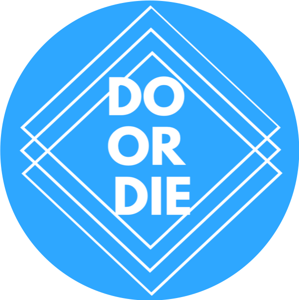
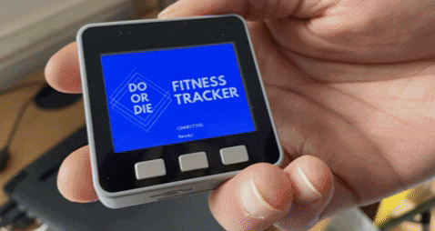
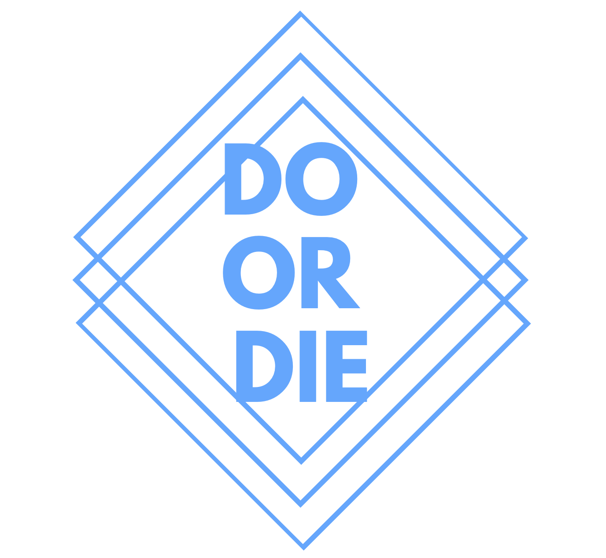

    

<h1 align="center"> Do or Die Fitness Tracker </h1>

<b> A fitness tracker with a twist. Built with <a href="https://github.com/m5stack">M5Stack</a>, <a href="https://github.com/facebook/react">React</a>, and <a href="https://github.com/processing">Processing</a>. 
</b>

 

    <a href="https://github.com/Team-Jag/Do-or-die-fitness-tracker#the-product">The Product</a>
   .
    <a href="https://github.com/Team-Jag/Do-or-die-fitness-tracker/#the-user">The User</a>
    .
    <a href="https://github.com/Team-Jag/Do-or-die-fitness-tracker/#the-stakeholders">The Stakeholders</a>
    . 
  <a href="https://github.com/Team-Jag/Do-or-die-fitness-tracker/#the-process">The Process</a>
 .
    <a href="https://github.com/Team-Jag/Do-or-die-fitness-tracker#the-team">The Team</a>
 . 
  <a href="https://github.com/Team-Jag/Do-or-die-fitness-tracker/#built-with">Built With</a>
 . 
  <a href="https://github.com/Team-Jag/Do-or-die-fitness-tracker/#acknowledgments">Acknowledgments</a>
  

  

  

## The Product
Do or Die is a wearable fitness tracker, designed to inspire users to get active and have fun while doing so. There to motivate you is the your new friend Bean, found on the face of your fitness tracker. The more active you are, the more time that is added to Bean's health bar. However, if you fail to meet your step goals, Bean's health bar will slowly decrease. So be careful as once the health bar reaches zero, Bean will die. Get active, meet your step goals, and keep Bean alive. 

If setting your own goals is not enough motivation, meet our Sponsors! With new challenges weekly, and amazing prizes up for grabs, there's even more reason to keep your Bean's health level up. On top of that, once you register with Do or Die you can access your account details on our website where you can keep track of long term progress, and challenge your friends along the way. 

The goal is simple, keep the Bean's health bar above zero by getting out and getting active. This is Do or Die, do you have what it takes?

## The User
When designing Do or Die we had one goal in mind: make fitness fun. Many of the fitness trackers already on the market focus heavily on those who are already active, and very little on helping those new to fitness get in to it, so [the team](#the-team) wanted to make a fitness product that doubled as a game. By doing these we create new incentives and rewards for an individual to improve their own health. 

In order to guide you through our user-centered approach to designing our system, as well as the implementation, we will be focusing on a single user to show you how our product can be used. So, meet Mario! 

> I'm Mario. I am in my 20's, love to play games, and am very competitive. Recently I have been interested in getting more active but find myself getting bored really easily, and find it hard to stay motivated.  

Using Mario as our focus use case, while also highlighting how other user groups can use our system, we will guide you through the process of making Do or Die. 

## The Stakeholders
In addition to our end-user, the design of our system also focused around two other user types: the Administrator, and the Sponsor. Using our Management Dashboard, made using Processing, the Admin can track individual and general user statistics as well as user details. Our second stakeholder, the Sponsor, uses the website to create challenges for the end-user. This sponsor is likely a local businesss owner, looking to generate more exposure by creating challenges directly linked to their own business or product. You can learn more about our [Stakeholders](https://github.com/Team-Jag/Do-or-die-fitness-tracker/blob/develop/Portfolio/SystemDesign.md#stakeholders), and how they influenced our [requirements](https://github.com/Team-Jag/Do-or-die-fitness-tracker/blob/develop/Portfolio/SystemDesign.md#user-requirements-for-each-subsystem) for our key subsystems, in our [System Design](Portfolio/SystemDesign.md) section of our Portfolio.

## The Process
In our portfolio we will analyse all aspects of the process of developing our product. This starts our ideation process, moving to how we designed the system, and finally how it was implemented. We will also discuss potential areas for future work, how our team worked remotely, and how successful we felt that our project was. Each of the subsections of our portfolio are detailed below. 

### 1. [System Design](Portfolio/SystemDesign.md)
View our [system design document](Portfolio/SystemDesign.md) to see:
* Product requirements
* User requirements for key subsystems
* Architecture of the entire systems
* Object-oriented design of key subsystems
* The evolution of UI wireframes for key subsystems
* Details of the communication protocols in use
* Details of the data persistence mechanisms in use
* Details of web technologies in use

### 2. [System Implementation](Portfolio/SystemImplementation.md)
View our [system implementation document](Portfolio/SystemImplementation.md) to see:
* Software design cycle
* Breakdown of our project into sprints
* Design evaluation
* Social and ethical implications of our work

### 3. [Project Evaluation](Portfolio/ProjectEvaluation.md)
View our [project evaluation](Portfolio/ProjectEvaluation.md) to see:
* Reflective discussion of the success of the project
* Discussion of future work
* Reflection on working practices of our group

## The Team

* [Davide Bernardi](https://github.com/DavideBernardi) : <db16981@bristol.ac.uk>
* [Chris Buehler](https://github.com/Chris19138) : <christoph.buehler.2019@bristol.ac.uk>
* [Amy Conroy](https://github.com/amyconroy) : <ac16888@bristol.ac.uk>
* [Graciela Putri](https://github.com/gracielawp) : <tl19232@bristol.ac.uk>
* [Anastasia Shmyglya](https://github.com/a-shmyg) : <ge19548@bristol.ac.uk>
* [Oliver Skeates](https://github.com/OliSkeates) : <an19572@bristol.ac.uk>

## Built With
* [M5Stack](https://github.com/m5stack)
* [Processing](https://github.com/processing)
* [React](https://github.com/facebook/react) 

#### M5Stack Libraries & Referenced Code
* [M5Stack Default Library](https://github.com/m5stack/M5Stack)
* [WiFi Library](https://github.com/m5stack/M5Stack)
* [Supplementary WiFi Library for ESP32](https://github.com/espressif/arduino-esp32/blob/master/tools/sdk/include/esp32/esp_wifi.h)
* [MQTT Communcation Library](https://github.com/knolleary/pubsubclient/blob/master/src/PubSubClient.h)
* [Time Library](https://github.com/PaulStoffregen/Time)
* [MPU9250 Pedometer Class](https://gist.github.com/botamochi6277/7bfc4e15443cfbaa3ab9882f6a953868#file-dualmpu9250basic-ino)

#### Processing Libraries
* [ControlP5 Processing Libary](http://www.sojamo.de/libraries/controlP5/)
* [MQTT Communication Library](https://github.com/256dpi/processing-mqtt)

#### React Template 
* [Now UI Kit](https://demos.creative-tim.com/now-ui-kit/index.html)

## Acknowledgments
A big thank you to everyone whose code and libraries we used during this project, referenced above. We are also incredibly thankful for the support and guidance of our lecturers: Simon Lock, Tom Bale, Pete Bennett, and Paul O'Dowd. We have learnt so much from them, and are excited to implement the skills that they have taught us in our future careers. 

