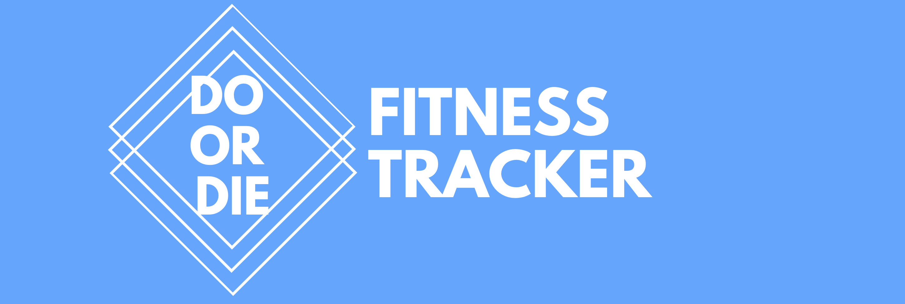

## Product Description
Do or Die is a wearable fitness tracker, designed to inspire users to get active and have fun while doing so. There to motivate you is the your new friend Bean, found on the face of your fitness tracker. The more active you are, the more time that is added to Bean's health bar. However, if you fail to meet your step goals, Bean's health bar will slowly decrease. So be careful as once the health bar reaches zero, Bean will die. Get active, meet your step goals, and keep Bean alive. 

If setting your own goals is not enough motivation, meet our Sponsors! With new challenges weekly, and amazing prizes up for grabs, there's even more reason to keep your Bean's health level up. On top of that, once you register with Do or Die you can access your account details on our website where you can keep track of long term progress, and challenge your friends along the way. 

The goal is therefore simple, keep the Bean's health bar above zero by getting out and getting active. This is Do or Die, do you have what it takes?

## Team Members
* [Davide Bernardi](https://github.com/DavideBernardi) : <db16981@bristol.ac.uk>
* [Chris Buehler](https://github.com/Chris19138) : <christoph.buehler.2019@bristol.ac.uk>
* [Amy Conroy](https://github.com/amyconroy) : <ac16888@bristol.ac.uk>
* [Graciela Putri](https://github.com/gracielawp) : <tl19232@bristol.ac.uk>
* [Anastasia Shmyglya](https://github.com/a-shmyg) : <ge19548@bristol.ac.uk>
* [Oliver Skeates](https://github.com/OliSkeates) : <an19572@bristol.ac.uk>

## Acknowledgments
We are incredibly thankful for the support and guidance of Simon Lock, Tom Bale, Pete Bennett, and Paul O'Dowd. We have learnt so much from them, and are excited to implement the skills that they have taught us in our future careers. 

## Portfolio
In our portfolio we will analyse all aspects of the development of our product, from how we designed the system, to how it was implemented. We will also discuss potential areas for future work, how our team worked remotely, and how successful we felt that our project was. Each of the subsections of our portfolio are defined below. 

## 1. [System Design](Portfolio/SystemDesign.md)
View our [system design document](Portfolio/SystemDesign.md) to see:
* Product requirements
* User requirements for key subsystems
* Architecture of the entire systems
* Object-oriented design of key subsystems
* The evolution of UI wireframes for key subsystems
* Details of the communication protocols in use
* Details of the data persistence mechanisms in use
* Details of web technologies in use

## 2. [System Implementation](Portfolio/SystemImplementation.md)
View our [system implementation document](Portfolio/SystemImplementation.md) to see:
* Breakdown of our project into sprints
* Design evaluation
* Social and ethical implications of our work

## 3. [Project Evaluation](Portfolio/ProjectEvaluation.md)
View our [project evaluation](Portfolio/ProjectEvaluation.md) to see:
* Reflective discussion of the success of the project
* Discussion of future work
* Reflection on working practices of our group

### REFERENCES

#### M5Stack Libraries & Referenced Code
[M5Stack Default Library](https://github.com/m5stack/M5Stack)

[WiFi Library](https://github.com/m5stack/M5Stack)

[Supplementary WiFi Library for ESP32](https://github.com/espressif/arduino-esp32/blob/master/tools/sdk/include/esp32/esp_wifi.h)

[MQTT Communcation Library](https://github.com/knolleary/pubsubclient/blob/master/src/PubSubClient.h)

[Time Library](https://github.com/PaulStoffregen/Time)

[MPU9250 Pedometer Class](https://github.com/m5stack/M5Stack/blob/master/examples/Fire/M5StackFire_MPU9250/M5StackFire_MPU9250.ino)

#### Processing Libraries
[ControlP5 Processing Libary](http://www.sojamo.de/libraries/controlP5/)

[MQTT Communication Library](https://github.com/256dpi/processing-mqtt)

